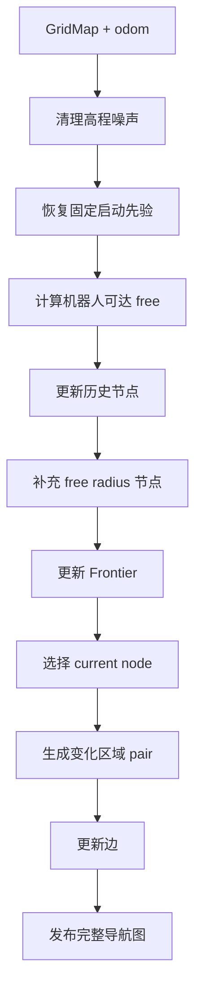

# 实机导航图更新

## 1. 输入和输出

| 方向 | 数据 | 用途 |
|---|---|---|
| 输入 | elevation `GridMap` | free、obstacle、unknown 和高程 |
| 输入 | `/spot1/odom_for_scoring` | 机器人位置 |
| 输出 | `/spot1/nav_graph` | 持久导航图 |
| 输出 | `/spot1/graph_construction_viz` | RViz 诊断 |

## 2. 数据语义

- `free` 是当前确认可通行区域
- `obstacle` 是当前明确不可通行区域
- `unknown` 是当前看不到的区域
- rolling map 滑出后的 unknown 不直接删除历史安全路线
- 新障碍会删除冲突节点和边

## 3. 更新流程

## 4. 小推车启动盲区

MID360 位于三相机结构上方, 雷达正下方存在近场盲区

当前实机使用两层低置信度先验:

1. elevation mapping 以 `base_link` 为中心创建 1.0 m 方形地面锚点
2. 初始化结果膨胀 2 cell
3. graph construction 以 0.8 m 为盲区种子
4. 只在 2.0 m 搜索半径内填充与种子相连的 unknown 分量
5. 连接到外围原始 free 后保存固定世界坐标先验

当前参数:

| 参数 | 值 |
|---|---:|
| `initialize_tf_grid_size` | 1.0 m |
| `dilation_size_initialize` | 2 cell |
| `robot_blind_zone_radius` | 0.8 m |
| `robot_blind_zone_elevation_search_radius` | 2.0 m |
| `robot_ground_height_offset` | 0.90 m |
| `min_obstacle_clearance` | 0.5 m |

实机首帧验证:

- 最近真实地面约 1.8 m
- 人工修补约 296 cell
- 搜索半径 2.0 m
- 状态为 `repaired_connected`

修补必须满足:

- 不覆盖 obstacle
- 不穿过墙体或受保护高程尖峰
- 高度接近机器人预期地面
- 初始化完成后不跟随机器人移动
- 后续真实 obstacle 可以覆盖人工先验

状态含义:

| 状态 | 含义 |
|---|---|
| `repaired_connected` | 本帧完成修补并连接外围真实 free |
| `repaired_waiting_boundary` | 已修补但尚未连接真实 free |
| `known_ground` | 原始 free 已连通 |
| `known_ground_isolated` | 脚下 free 仍是孤岛 |
| `initial_prior_restored` | 固定启动先验已恢复且仍连通 |
| `initial_prior_disconnected` | 固定先验被真实地图切断 |

## 5. 节点

节点使用论文 free radius 采样:

- 只在机器人可达的 free 分量采样
- 半径由 obstacle 距离、unknown 距离和 `max_free_radius` 共同限制
- 候选落入已有节点覆盖范围时拒绝
- 节点 UUID 在持久图中保持稳定
- unknown 或 obstacle 中不创建兜底节点

## 6. 边

半径不超过 `edge_radius` 的节点 pair 按走廊状态处理:

- 已知且安全则添加或保留
- obstacle 或净空不足则删除
- unknown 不添加新边, 但保留已有历史安全边

首帧构建完整局部半径图, 后续只处理新增节点或 dirty cell 影响的 pair

稳定帧不得重复检查全部局部 pair

## 7. Frontier 和 current node

- Frontier 是 free 与 unknown 的边界
- Frontier 挂在附近安全节点上
- rolling map 外边缘不作为真实 Frontier
- `current_node` 优先选择机器人附近可安全直达的普通节点
- 边更新后记录完整图和 current node 分量统计

## 8. 关键参数

| 参数 | 当前值 |
|---|---:|
| `node_sample_count` | 1000 |
| `max_free_radius` | 4.0 m |
| `min_obstacle_clearance` | 0.5 m |
| `edge_radius` | 8.0 m |
| `frontier_candidate_spacing` | 0.5 m |
| `viz_show_full_edges` | false |

算法默认值位于 `GraphBuilderConfig`, 实机覆盖值位于 `graph_construction/configs/graph_construction_elevation.yaml`

## 9. 实机验收

- 启动人工区域不超过墙体和桌边
- 静止时高程图、点云和导航图持续显示
- 小推车运动后历史节点和边不消失
- 新障碍删除危险节点和边
- `current_node` 与局部节点属于同一图分量
- 持续运行时 graph 更新耗时和消息年龄没有增长失控
