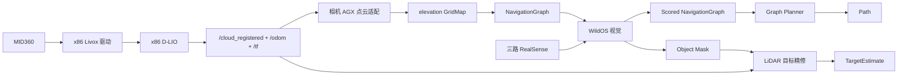

# WildOS 实机系统概览

> 本文只描述 `sim2real` 分支当前 Unitree GO2 实机主线

## 1. 系统目标

WildOS 在未知环境中使用 LiDAR、IMU 和三路相机完成定位、局部高程建图、持久导航图、视觉探索、目标定位和路径规划

## 2. 主机分工

| 主机 | 容器 | 职责 |
|---|---|---|
| x86 | `lidar` | MID360 驱动, 发布原始点云和 IMU |
| x86 | `localization` | D-LIO, 发布注册点云、odom 和 TF |
| 相机 AGX | `cameras` | 2 台 D435i 和 1 台 D435if |
| 相机 AGX | `wildos` | 点云适配、高程图、导航图、视觉、目标融合和 Planner |

GO2 底层主机与相机 AGX 保持 `eno1` 有线直连. 点云 x86 通过独立 `192.168.50.0/24` 有线链路向相机 AGX 提供 D-LIO 输出, MID360 使用 x86 的独立 `192.168.11.0/24` 网段

## 3. 当前主链路

唯一几何地图输入是 elevation `GridMap`

## 4. 关键内部数据

| 数据 | Topic | 作用 |
|---|---|---|
| 注册点云 | `/cloud_registered` | x86 到相机 AGX 的跨机输入 |
| 本地点云 | `/spot1/cloud_registered_local` | 高程图和目标融合输入 |
| canonical odom | `/spot1/odom_for_scoring` | 图、视觉和 Planner 共用位姿 |
| 高程图 | `/elevation_mapping_node/elevation_map_raw` | 当前局部地面 |
| 导航图 | `/spot1/nav_graph` | 长期安全拓扑 |
| 评分图 | `/spot1/scored_nav_graph` | Planner 输入 |
| 路径 | `/spot1/graphnav_planner/path` | 仓库外运动执行输入 |

## 5. 当前启动

x86 和相机 AGX 分别使用仓库根目录的两个 Compose 文件:

- `compose.x86_64.lidar-dlio.yaml`
- `compose.orin.wildos-cameras.yaml`

部署步骤见 [Docker 部署](../deployment/docker.md)

## 6. 配置入口

| 内容 | 文件 |
|---|---|
| 实机 topic 和 frame | `graph_construction/configs/topic_profiles.yaml` 的 `robot` profile |
| D-LIO | `graph_construction/configs/dlio/mid360.yaml` |
| 高程图 | `graph_construction/configs/elevation_mapping.yaml` |
| 图构建 | `graph_construction/configs/graph_construction_elevation.yaml` |
| 视觉 | `visual_navigation/configs/wildos_nav_conf.yaml` |
| 相机标定与模型路径 | `.env.orin.wildos-cameras` |
| 雷达与 D-LIO 路径 | `.env.x86_64.lidar-dlio` |

带 `sim` 的 launch 和配置名称是历史兼容命名, 当前 Docker 实机入口仍使用这些文件

## 7. 当前风险

- GO2 新安装后, MID360 安装姿态、LiDAR 到地面高度和近场盲区均需重新测量
- 三相机外参目前为近似值
- `/cloud_registered` 跨机传输是主要带宽和延迟风险
- 高程启动先验需要继续验证墙边和狭窄通道不会越界
- D-LIO 需要完成转弯、震动和长时间运动测试
- 目标搜索仍需完成实机端到端验收
