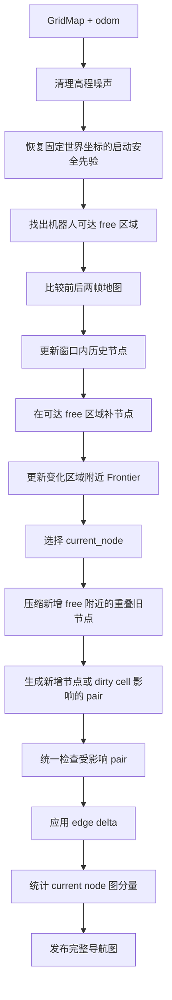

# 导航图更新

> 更新时间: 2026-07-27

## 1. 为什么需要导航图

高程图只保存机器人附近的局部地面, 机器人走远后, 身后的区域会滑出地图

导航图把走过的安全路线长期保存下来, 供目标搜索和路径规划使用

```text
高程图 = 当前附近看到了什么
导航图 = 到目前为止走过哪些安全路线
```

## 2. 输入和输出


| 方向 | 数据               | 用途                               |
| ---- | ------------------ | ---------------------------------- |
| 输入 | elevation`GridMap` | 提供高度、可通行性、障碍和 unknown |
| 输入 | odom               | 提供机器人位置                     |
| 输出 | `NavigationGraph`  | 给 WildOS 和 Planner 使用          |
| 输出 | Marker             | 在 RViz 显示节点、边和 Frontier    |

## 3. 图里有什么

### 节点

节点代表可以站立或经过的位置, 保存位置、安全半径、已探索范围和稳定 UUID

节点按论文 Algorithm 3 随机采样:

- 只在机器人可达的已知 free 区域采样
- 节点必须满足 obstacle 和 unknown 安全距离
- 候选落入已有节点的 free radius 时拒绝
- 本帧刚接受的节点也立即参与覆盖检查

因此开阔区域节点自然稀疏, 障碍和 unknown 附近自然变密

### 边

边表示两个节点之间可以直接通行

新边必须满足:

- 节点距离在连接范围内
- 连线不穿过 obstacle
- 连线不穿过 unknown
- 与障碍保持安全距离
- 半径内所有安全节点全部连边

不再限制最近 4 条边、current node 12 条边或单节点 24 个候选

### Frontier

Frontier 是 free 和 unknown 的交界, 表示继续前进可能看到新区域

Frontier 挂在附近已有节点上, 不为每个 Frontier cell 创建新节点

### 当前节点

`current_node` 是 Planner 的图搜索起点

系统优先选择机器人附近、可以安全直达的普通节点

附近没有安全节点时, 只有机器人脚下明确为 free 才创建普通兜底节点

旧的移动 anchor 已删除, 机器人行走不会再留下额外 breadcrumb

## 4. 更新流程



## 5. 地图预处理

### 高程噪声

孤立高点可能来自点云噪声, 系统会比较周围高程, 把明显异常的 cell 恢复为 unknown

### 脚下盲区

顶部 LiDAR 很难直接看到机器狗正下方, 系统在启动时将初始区域作为低置信度安全先验

旧实现只填充固定 4.0 m 圆

真实点云盲区大于 4.0 m 时, 人工 free 圆和外围真实 free 之间仍会留下 unknown 环

新边不能穿过 unknown, 因此 current node 会停在人工孤岛中

当前实现改为:

1. `robot_blind_zone_radius=4.0 m` 定义盲区种子范围
2. 找出种子范围和已有脚下 free 岛边界接触的全部 unknown 分量
3. 在 `robot_blind_zone_elevation_search_radius=12.0 m` 内完整填充这些分量
4. 使用附近可信地面或机器人预期地面初始化高程
5. 检查机器人 free 分量是否已经接到搜索边界上的原始 free
6. 只有实际连通后才结束启动修补
7. 将人工 cell 保存为固定世界坐标先验, 后续帧只恢复原启动区域

修补仍需满足:

- 不覆盖 obstacle
- 周围存在可信地面
- 高度接近机器人预期地面
- 不位于高程尖峰保护区

状态含义:

| 状态 | 含义 |
| --- | --- |
| `repaired_connected` | 已填满连通盲区并接到外围原始 free |
| `repaired_waiting_boundary` | 已填充盲区, 但还没有接到外围原始 free |
| `known_ground` | 不需要填充, 脚下原始 free 已经连到搜索边界 |
| `known_ground_isolated` | 没有可填充 cell, 但脚下 free 仍是孤岛 |
| `initial_prior_restored` | 固定启动先验已恢复, 当前仍连接外部 free |
| `initial_prior_disconnected` | 固定启动先验已恢复, 但当前已被真实地图切断 |

初始化完成后, 安全先验不会跟随机器人移动, 但同一世界区域不会在第二帧重新变回 unknown

人工填充的 cell 会单独标记, 不会被当作传感器确认的新 free, 因此不会触发历史旧边批量重建

后续点云优先级更高:

- 点云确认 free 时更新人工区域的高程和安全半径
- 点云确认 obstacle 时删除对应节点和经过该区域的边
- 点云仍为 unknown 时保留启动阶段已经确认的人工路线

### 可达区域

新节点只生成在机器人能够到达的 free 连通区域

启动修补必须先把脚下盲区变成连续 free, 图更新才允许在该区域生成安全边

隔着 unknown 的其他 free 分量不再被合并到 reachable mask, 当前帧不会在这些伪可达区域生成新节点

边更新完成后会从 `current_node` 执行 BFS, 记录:

- 完整图分量数
- current node 分量节点数
- current node 分量中的局部节点数
- 当前局部节点是否全部连通

这些统计用于区分“栅格已连通”和“NavigationGraph 已连通”

## 6. 历史节点如何处理

系统使用持久空间索引, 只查询当前 GridMap 范围内的节点


| 当前地图状态 | 历史节点处理       |
| ------------ | ------------------ |
| obstacle     | 删除节点和相关边   |
| free         | 更新高度和安全范围 |
| unknown      | 保留历史节点       |
| 已滑出窗口   | 保持不变           |

unknown 只代表当前看不到, 不能否定以前确认安全的路线

当 unknown 变为真实 free 时, 历史节点的 free radius 可能扩大

系统只在新增 free 附近压缩旧节点:

- current node 和 Frontier owner 保留
- 不在变化区域附近的历史节点保持不动
- 普通节点被更大安全自由圆覆盖时删除
- 删除节点后只重算受影响 pair

## 7. 新节点和 Frontier

每帧在当前可达 free cell 中随机采样固定次数, 默认 1000 次

节点的 free radius 为 obstacle 距离、unknown 距离和最大半径三者的最小值

候选落入任何已有节点的 free radius 时不会生成, 不再使用固定世界网格和最小节点间距参数

Frontier 更新步骤:

1. 找到 free 和 unknown 的边界
2. 去掉 rolling map 外边缘产生的假 Frontier
3. 重新检查当前仍可见的历史 Frontier
4. 去掉已经探索或走过的区域
5. 把新 Frontier 分配给附近安全节点
6. 删除过小或过短的噪声区域

## 8. 旧边更新为什么越来越慢

旧逻辑把少量地图变化扩大到附近大量节点, 再为每个节点检查很多候选边

```text
少量变化 cell
  -> 找到附近大量节点
  -> 为每个节点重新找邻居
  -> 重复检查数千条候选边
```

旧实现还保存 unknown blocked candidate 和低连接重试状态

这些状态会随探索历史积累, 少量 unknown 变 free 也可能唤醒大量节点和候选

## 9. 当前论文式增量边更新

当前实现只保留一条拓扑规则:

```text
当前窗口内距离不超过 edge_radius 的全部节点 pair
  -> 走廊已知且安全: 添加或保留
  -> 走廊出现 obstacle 或净空不足: 删除已有边
  -> 走廊出现 unknown: 不添加新边, 保留已有边
```

首帧使用 `cKDTree.query_pairs()` 建立完整局部半径图

后续帧按变化类型处理:

| 变化 | 处理 |
|---|---|
| 节点和地图都稳定 | 直接复用全部边, 不生成 pair |
| 新增节点 | 只检查新节点的半径内 incident pair |
| 新 obstacle | 通过边空间索引复查经过变化区域的历史边 |
| unknown 变 free | 只生成可能经过变化 cell 的半径 pair |
| free 变 unknown | 保留历史安全边, 没有新节点时不检查 pair |

长度不超过 `edge_radius` 的线段经过变化 cell 时, 至少有一个端点到该 cell 的距离不超过一半连接半径

实现利用这个几何条件查询近端点, 再只生成这些端点的直接半径 pair, 不再把少量变化扩大成全部局部 pair

每帧记录三种边模式:

- `full`: 首帧或节点位置变化, 重建完整局部半径图
- `incremental`: 只检查新增节点或 dirty cell 影响的 pair
- `stable_reused` 或 `reused`: 没有会改变拓扑的 pair, 直接复用

边只有存在和不存在两种拓扑状态

是否已经走过仍可作为边的普通属性, 不能改变基本连边规则

### Python 热路径

- obstacle 和 unknown 距离场继续使用 SciPy
- reachable free 连通分量继续使用 SciPy
- 局部 pair 生成使用 SciPy `cKDTree`
- 栅格线生成使用 `skimage.draw.line` 的 Cython 实现
- obstacle、unknown 和两个 SDF 预先合并成一个状态栅格

正向和反向栅格线在穿过 cell 角点时可能选择不同 cell

当前会合并两个方向形成保守 supercover, 防止斜边漏检障碍角点

逐 pair Python Bresenham、候选截断、历史边回灌和多种边角色已经删除

## 10. 为什么仍发布完整图

内部计算是增量的, 但 WildOS 和 Planner 当前仍消费完整 `NavigationGraph`

系统通过以下方式降低发布成本:

- 未变化节点和边复用 ROS 消息缓存
- 完整图按固定频率发布
- RViz 可视化单独限频
- RViz 默认只显示从 current node 开始的生成森林
- `viz_show_full_edges=true` 时才显示完整半径图
- 自动化测试确认消息转换不会修改内部图、邻接索引或 current node

剩余风险是消息数组仍会随历史图增长, 后续通过用户提供的完整运行日志检查消息转换耗时

## 11. 必须保持的行为

- rolling map 移动后历史节点和边不能消失
- 新障碍必须删除冲突节点和边
- unknown 不能直接删除历史安全路线
- 节点 UUID 必须稳定
- `current_node` 必须安全可达
- unknown 中不能虚构节点或边
- 新边不能穿过 unknown 或 obstacle
- 图更新异常不能覆盖上一张有效图

## 12. 性能记录

### 优化前 Unity 长任务

2026-07-22 运行约 11 分 34 秒:


| 指标               |        启动附近 |  后期约 500 nodes |
| ------------------ | --------------: | ----------------: |
| 总耗时平均值       |       约 153 ms |  约 376 至 425 ms |
| 总耗时 P95         |       约 241 ms |  约 443 至 533 ms |
| 边更新平均值       |        约 67 ms |  约 245 至 264 ms |
| graph 消息年龄 P95 | 约 0.6 至 0.7 s | 约 0.85 至 0.99 s |

### 旧增量方案基准

之前记录的 1.1 至 7.3 ms 只覆盖稳定地图和少量精确变化

它没有覆盖 unknown blocked candidate 长期积累后的集中重试, 因此不能代表 Unity 长任务性能

### 2026-07-23 全 pair 实现基准

本机 250 个随机局部节点、5859 个半径 pair:

| 阶段 | 修改前 | 当前实现 |
|---|---:|---:|
| pair 生成 | 约 32.4 ms | 约 0.6 ms |
| 全部 pair 安全检查 | 约 549 ms | 约 98 ms |
| 稳定帧边阶段总耗时 | 约 555 ms | 约 98 ms |
| 首帧新增全部 5859 条边 | 未记录 | 约 215 ms |

首次写入全部边会额外更新邻接表和边空间索引

稳定帧没有 edge delta, 未变化边对象和索引保持不动

30 m × 30 m、0.1 m 分辨率的全 free 合成地图:

- 每帧随机采样 1000 次
- 前两帧后局部图约 68 nodes、312 edges
- 第一帧纯 `builder.update` 约 79 ms
- 第二帧纯 `builder.update` 约 86 ms
- 两帧边阶段分别约 14 ms 和 7 ms

以上是本机合成基准, 不包含 GridMap 上游、ROS 传输和 RViz

### 2026-07-27 增量实现结果

- 相同地图第二帧 `candidate_pair_count=0`
- 相同地图第二帧 `edge_clearance_check_count=0`
- 单个远离边的 obstacle 变化不检查 pair
- 单个穿越边的 obstacle 变化只检查命中的边
- unknown 变 free 只生成变化区域附近端点的 incident pair
- 新增 free 附近被更大自由圆覆盖的普通旧节点会被压缩
- 隔着 unknown 的外围 free 分量不再生成新节点
- 节点只更新 Z 高程时不再重建关联边的 XY 空间索引

20 m × 20 m、0.25 m 分辨率、250 个手工密集节点的合成压力测试:

| 帧 | pair 检查 | `builder.update` |
|---|---:|---:|
| 首帧完整构图 | 13497 | 约 642 ms |
| 相同地图稳定帧 | 0 | 约 17 ms |
| 单个新 obstacle | 1527 | 约 70 ms |

该压力测试故意跳过 free radius 采样, 直接放入 250 个密集节点, 用于验证最坏情况下的边失效粒度

自动化结果:

- 图构建和持久图核心测试 63 项通过
- ROS 镜像中与本次修改相关的 138 项测试通过
- 镜像内另外 8 项 launch 测试读取了旧安装空间的 topic profile, 与本次图修改无关
- ROS `graph_construction` 包在临时工作区构建通过
- flake8 忽略项目已有的 E501 和 W503 后通过

### 仍需验证

- 从新运行日志检查节点密度是否稳定
- 从新运行日志检查 graph 消息年龄 P95
- 从新运行日志检查新障碍出现后的边删除统计
- 检查完整消息转换是否成为新的主要耗时
- 使用 Unity 连续运行至少 10 分钟

## 13. 关键参数


| 参数                            | 当前值 | 含义                       |
| ------------------------------- | -----: | -------------------------- |
| `robot_blind_zone_radius`                  |  4.0 m | 启动盲区种子半径           |
| `robot_blind_zone_elevation_search_radius` | 12.0 m | 连通盲区最大搜索半径       |
| `node_sample_count`                        |   1000 | 每帧随机采样次数           |
| `max_free_radius`                          |  4.0 m | 开阔区域最大节点覆盖半径   |
| `min_obstacle_clearance`                   |  0.5 m | 论文使用的节点和边安全距离 |
| `edge_radius`                              |  8.0 m | 论文使用的最大连边距离     |
| `initialize_tf_grid_size`                  | 12.0 m | 高程图源头启动安全先验边长 |
| `viz_show_full_edges`                      |  false | 是否在 RViz 显示全部实际边 |

算法默认值定义在 `GraphBuilderConfig`, ROS 覆盖值位于 `graph_construction/configs/graph_construction_elevation.yaml`

启动盲区只在连通完成前扩展, 随机采样固定使用种子 7, 两者属于实现约束而不是部署参数

## 14. 代码入口

- `graph_construction/graph_construction/graph_builder.py`
- `graph_construction/graph_construction/graph_memory.py`
- `graph_construction/graph_construction/frontier_detector.py`
- `graph_construction/graph_construction/edge_builder.py`
- `graph_construction/graph_construction/grid_adapter.py`
- `graph_construction/graph_construction/node.py`
