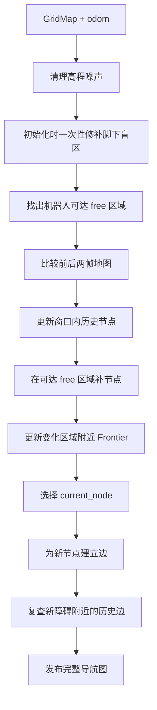

# 导航图更新

> 更新时间: 2026-07-23

## 1. 为什么需要导航图

高程图只保存机器人附近的局部地面, 机器人走远后, 身后的区域会滑出地图

导航图把走过的安全路线长期保存下来, 供目标搜索和路径规划使用

```text
高程图 = 当前附近看到了什么
导航图 = 到目前为止走过哪些安全路线
```

## 2. 输入和输出


| 方向 | 数据               | 用途                               |
| ---- | ------------------ | ---------------------------------- |
| 输入 | elevation`GridMap` | 提供高度、可通行性、障碍和 unknown |
| 输入 | odom               | 提供机器人位置                     |
| 输出 | `NavigationGraph`  | 给 WildOS 和 Planner 使用          |
| 输出 | Marker             | 在 RViz 显示节点、边和 Frontier    |

## 3. 图里有什么

### 节点

节点代表可以站立或经过的位置, 保存位置、安全半径、已探索范围和稳定 UUID

节点在世界坐标固定网格上生成:

- 障碍和 unknown 附近更密
- 开阔区域更稀
- 同一个物理位置不会因 rolling map 移动反复生成

### 边

边表示两个节点之间可以直接通行

新边必须满足:

- 节点距离在连接范围内
- 连线不穿过 obstacle
- 连线不穿过 unknown
- 与障碍保持安全距离
- 每个节点只保留有限数量的近邻边

### Frontier

Frontier 是 free 和 unknown 的交界, 表示继续前进可能看到新区域

Frontier 挂在附近已有节点上, 不为每个 Frontier cell 创建新节点

### 当前节点

`current_node` 是 Planner 的图搜索起点

系统优先选择机器人附近、可以安全直达的普通节点

附近没有安全节点时, 只有机器人脚下明确为 free 才创建普通兜底节点

旧的移动 anchor 已删除, 机器人行走不会再留下额外 breadcrumb

## 4. 更新流程



## 5. 地图预处理

### 高程噪声

孤立高点可能来自点云噪声, 系统会比较周围高程, 把明显异常的 cell 恢复为 unknown

### 脚下盲区

顶部 LiDAR 很难直接看到机器狗正下方, 系统在启动时允许保守修补机器人附近的 unknown

修补必须满足:

- 不覆盖 obstacle
- 周围存在可信地面
- 高度接近机器人预期地面
- 不位于高程尖峰保护区

当前配置半径为 4.0 m

修补只在第一帧有效地图执行一次

初始化完成后, 修补区域不会跟随机器人移动

人工填充的 cell 会单独标记, 不会被当作传感器确认的新 free, 因此不会触发历史旧边批量重建

### 可达区域

新节点只生成在机器人能够到达的 free 连通区域

如果脚下修补形成孤立小岛, 系统可以跨过没有明确障碍的盲区连接外围 free 区域, 但不会把整片 unknown 改成 free

## 6. 历史节点如何处理

系统使用持久空间索引, 只查询当前 GridMap 范围内的节点


| 当前地图状态 | 历史节点处理       |
| ------------ | ------------------ |
| obstacle     | 删除节点和相关边   |
| free         | 更新高度和安全范围 |
| unknown      | 保留历史节点       |
| 已滑出窗口   | 保持不变           |

unknown 只代表当前看不到, 不能否定以前确认安全的路线

## 7. 新节点和 Frontier

新节点在当前可达 free 区域的固定网格位置生成

这样可以避免 free 和 unknown 边界轻微抖动时重复生成节点

Frontier 更新步骤:

1. 找到 free 和 unknown 的边界
2. 去掉 rolling map 外边缘产生的假 Frontier
3. 重新检查当前仍可见的历史 Frontier
4. 去掉已经探索或走过的区域
5. 把新 Frontier 分配给附近安全节点
6. 删除过小或过短的噪声区域

## 8. 边为什么曾经越来越慢

旧逻辑把少量地图变化扩大到附近大量节点, 再为每个节点检查很多候选边

```text
少量变化 cell
  -> 找到附近大量节点
  -> 为每个节点重新找邻居
  -> 重复检查数千条候选边
```

图越大, 当前窗口内的节点越多, 边更新时间就越长

## 9. 当前增量边更新

地图变化分成三类:


| 变化         | 处理方式                         |
| ------------ | -------------------------------- |
| 新 obstacle  | 查询并复查真正经过附近的历史边   |
| 新 free      | 生成新节点, 并局部重连附近旧节点 |
| 变成 unknown | 保留历史边, 不重复重建           |
| 初始化人工 free | 建立初始局部图, 不触发旧边重建 |

每条历史边都记录在世界空间索引中

新 free 出现后, 系统只通过持久空间索引查找附近旧节点并重建这些节点的边, 不扫描全量历史节点

现在边更新时间主要取决于本帧真实变化, 不再取决于历史图总大小

## 10. 为什么仍发布完整图

内部计算是增量的, 但 WildOS 和 Planner 当前仍消费完整 `NavigationGraph`

系统通过以下方式降低发布成本:

- 未变化节点和边复用 ROS 消息缓存
- 完整图按固定频率发布
- RViz 可视化单独限频

剩余风险是消息数组仍会随历史图增长, 后续通过用户提供的完整运行日志检查消息转换耗时

## 11. 必须保持的行为

- rolling map 移动后历史节点和边不能消失
- 新障碍必须删除冲突节点和边
- unknown 不能直接删除历史安全路线
- 节点 UUID 必须稳定
- `current_node` 必须安全可达
- unknown 中不能虚构节点或边
- 新边不能穿过 unknown 或 obstacle
- 图更新异常不能覆盖上一张有效图

## 12. 性能记录

### 优化前 Unity 长任务

2026-07-22 运行约 11 分 34 秒:


| 指标               |        启动附近 |  后期约 500 nodes |
| ------------------ | --------------: | ----------------: |
| 总耗时平均值       |       约 153 ms |  约 376 至 425 ms |
| 总耗时 P95         |       约 241 ms |  约 443 至 533 ms |
| 边更新平均值       |        约 67 ms |  约 245 至 264 ms |
| graph 消息年龄 P95 | 约 0.6 至 0.7 s | 约 0.85 至 0.99 s |

### 优化后代码基准

固定 500 nodes、约 1700 edges:


| 输入变化              | 历史边复查 | 边更新时间 |
| --------------------- | ---------: | ---------: |
| 50 个 free 变 unknown |          0 |  约 1.2 ms |
| 8 个新 obstacle       |         48 |  约 7.3 ms |
| 地图稳定              |          0 |  约 1.1 ms |

稳定地图连续 20 帧的纯 `builder.update` 平均约 47.3 ms

这个结果只验证纯图算法, 不包含 GridMap 上游、ROS 消息传输和 RViz

### 仍需验证

- 从新运行日志检查节点密度是否稳定
- 从新运行日志检查 graph 消息年龄 P95
- 从新运行日志检查新障碍出现后的边删除统计
- 检查完整消息转换是否成为新的主要耗时

### 2026-07-23 一次性修补测试

- 图构建和持久图测试共 49 项通过
- 初始化位置的 unknown 可以被修补
- 机器人移动到新 unknown 区域后不会继续人工填充
- 人工 free 不计入传感器 `newly_free`
- 真实 `unknown -> free` 仍能局部连接附近旧节点
- 新节点出现时仍会刷新对应 Frontier

## 13. 关键参数


| 参数                              | 当前值 | 含义                       |
| --------------------------------- | -----: | -------------------------- |
| `robot_blind_zone_radius`         |  4.0 m | 脚下保守修补范围           |
| `robot_blind_zone_initial_only`   |   true | 只在初始化阶段修补         |
| `min_node_separation`             |  1.0 m | 最小节点间距               |
| `min_obstacle_clearance`          |  0.5 m | 论文使用的节点和边安全距离 |
| `edge_radius`                     |  8.0 m | 论文使用的最大连边距离     |
| `max_edge_neighbors`              |      4 | 普通节点最大边数           |
| `current_node_max_edge_neighbors` |     12 | 当前节点最大边数           |
| `max_edge_candidates_per_node`    |     24 | 单节点最多检查的候选数     |

算法默认值定义在 `GraphBuilderConfig`, ROS 覆盖值位于 `graph_construction/configs/graph_construction_elevation.yaml`

## 14. 代码入口

- `graph_construction/graph_construction/graph_builder.py`
- `graph_construction/graph_construction/graph_memory.py`
- `graph_construction/graph_construction/frontier_detector.py`
- `graph_construction/graph_construction/edge_builder.py`
- `graph_construction/graph_construction/grid_adapter.py`
- `graph_construction/graph_construction/node.py`
