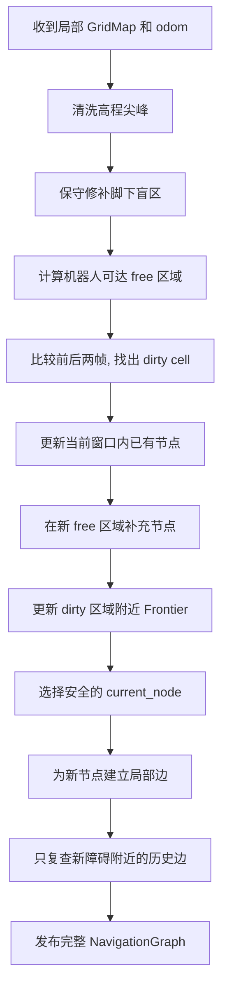

# 导航图更新

> 状态: 当前实现说明
>
> 更新时间: 2026-07-22

## 1. 这个模块解决什么问题

高程图只保存机器人附近的一块区域, 机器人向前走后, 身后的区域会滑出高程图

导航图需要把机器人走过的安全路线长期保存下来, 否则机器人只能看到脚下附近, 无法规划返回路线或记住以前经过的岔路口

可以把两种数据理解为:

- 高程图是机器人当前看到的局部地面
- 导航图是机器人持续绘制的路线骨架

## 2. 输入和输出

| 类型 | 内容 | 作用 |
|---|---|---|
| 输入 | elevation `GridMap` | 提供高程、可通行性、障碍和未知区域 |
| 输入 | 机器人 odom | 确定机器人位置和当前路径起点 |
| 输出 | `NavigationGraph` | 给 WildOS 评分和 Planner 规划使用 |
| 输出 | RViz Marker | 显示节点、边、Frontier、轨迹和机器人位置 |

主要代码:

- `graph_construction/graph_construction/grid_adapter.py`
- `graph_construction/graph_construction/graph_builder.py`
- `graph_construction/graph_construction/graph_memory.py`
- `graph_construction/graph_construction/frontier_detector.py`
- `graph_construction/graph_construction/edge_builder.py`
- `graph_construction/graph_construction/msg_utils.py`
- `graph_construction/graph_construction/node.py`

## 3. 图中各元素的含义

### 3.1 节点

节点代表一块可以站立或经过的安全区域

每个节点保存:

- 全局坐标位置
- 到障碍和未知区域的安全半径 `free_radius`
- 已经观察过的范围 `explored_radius`
- 稳定 UUID
- 是否拥有 Frontier

节点使用世界坐标对齐的分层网格采样, 高风险区域更密, 开阔区域更稀, 这样 rolling GridMap 移动时不会反复生成错开的副本

### 3.2 边

边表示两个节点之间可以直接通行

建立一条边需要满足:

- 两个节点距离不超过连接半径
- 连线没有穿过明确障碍
- 整条走廊与障碍、未知区域保持安全距离
- 每个节点只保留有限数量的近邻边

### 3.3 Frontier

Frontier 是已知自由区域和未知区域的交界, 表示“从这里继续走可能看到新区域”

Frontier cell 不会全部变成节点, 而是挂到附近已有节点上, 这个节点称为 Frontier owner

### 3.4 当前节点

`current_node` 是 Planner 的图搜索起点

当前实现优先选择机器人附近、可以从机器人位置安全直达的普通节点

如果附近没有安全节点, 只有机器人脚下明确为 free 时才创建一个普通兜底节点, unknown 和 obstacle 区域不会虚构节点或边

旧版持续跟随机器人的特殊 anchor 已删除, 机器人移动不会再留下额外 breadcrumb 节点

## 4. 当前更新流程

下面按实际执行顺序解释

## 5. 地图预处理

### 5.1 高程尖峰清理

局部孤立高点可能来自点云帘状噪声, 如果直接采样, 导航图会出现漂浮节点

当前实现比较一个 cell 和周围高程中值, 高差超过限制时把它恢复为 unknown, 不把它误判成安全地面

### 5.2 脚下盲区修补

顶部 LiDAR 很难直接看到机器狗机身正下方, 当前实现允许在机器人附近把部分 unknown 修补为 free

这个修补不是无条件填充, 必须满足:

- 不能覆盖已知 obstacle
- 周边存在可信地面
- 高程接近机器人预期地面
- 高程尖峰保护区不能被修补

当前默认半径为 1.2 m, 它是仿真测试参数, 仍需要与 0.8 m 做对照

### 5.3 可达 free 分量

系统从机器人脚下寻找连通的 free 区域, 新节点只允许采样在这部分区域

如果脚下修补形成了一个小 free 岛, 系统会在连边范围内寻找没有明确障碍隔开的外围 free 分量, 避免导航图只生成在脚下小圈内

## 6. 局部节点更新

`GraphState` 使用持久空间桶索引, 先查询当前 GridMap 包围盒内的节点, 不再每帧扫描所有历史节点

窗口内历史节点按以下规则处理:

- 落入 obstacle: 删除节点和关联边
- 落入 free: 更新高度、安全半径和已探索半径
- 落入 unknown: 保留历史记忆, 不因当前看不见而删除
- 已滑出窗口: 原样保留, 本帧不更新

这个规则很重要: unknown 代表“当前不知道”, 不能直接理解为“以前的安全路线已经不存在”

## 7. 新节点采样

新节点只在机器人当前可达且本帧新变为 free 的区域生成

当前采用世界坐标固定的自适应 lattice:

- 障碍或 unknown 附近使用较密网格
- 开阔区域使用较粗网格
- 与已有节点小于 `min_node_separation` 时不重复创建

因此节点会随探索区域扩大而增加, 但同一个物理位置不应因地图滑动重复增加节点

只处理新 free 区域还有一个作用: free 和 unknown 边界轻微抖动时, 不会在整块历史 free 区域反复切换到更密的采样层级

## 8. Frontier 更新

当前实现先计算完整 Frontier mask, 但只从 dirty cell 外扩一圈的区域提取新候选

处理顺序:

1. 找出 free 且邻近 unknown 的 cell
2. 去掉 rolling GridMap 外边缘产生的假 Frontier
3. 验证当前仍可见的历史 Frontier
4. 去掉已经探索或机器人已经走过的区域
5. 将新 Frontier 分配给附近可直达的普通节点
6. 使用点数和跨度过滤孤立噪声

滑出当前 GridMap 的 Frontier 不继续作为活动 Frontier 发布, 需要返回的历史岔路由 Planner 的 deferred branch 记忆

## 9. 增量边更新

边更新是当前最耗时的阶段

系统先把 GridMap 变化分成三类:

- 新 obstacle: 可能让历史边变得不安全
- 新 free: 可能产生新节点和新边
- 变成 unknown: 当前看不见, 但不能否定已经确认的历史边

每条历史边都在世界空间索引中记录自己经过的区域

更新时:

1. 新节点通过持久节点空间索引寻找最多 24 个近邻候选
2. 新候选边执行完整 free、unknown 和 obstacle 安全检查
3. 新 obstacle 直接查询真正经过附近区域的历史边
4. 只有这些历史边需要立即复查, 冲突边删除
5. free 变 unknown 不重建历史边
6. 未受影响边继续保留原对象, 不重复删除和创建

这样边更新工作量主要由本帧真实变化决定, 不再由当前窗口总节点数决定

## 10. 完整发布为什么仍然存在

内部计算是增量的, 但对外仍发布一张完整 `NavigationGraph`, 因为 WildOS 和 Planner 当前消费的是完整图消息

为降低转换成本:

- 节点和边消息使用内容签名缓存
- 未变化对象复用已有 ROS 消息对象
- 完整图按固定频率发布
- RViz 完整可视化单独限频

这能减少重复转换, 但消息数组长度仍会随历史图增大

## 11. 必须保持的行为

- rolling GridMap 移动后, 远处历史节点和边不能消失
- 当前明确障碍可以删除冲突节点和边
- 当前 unknown 不能否定已确认的历史安全路线
- 节点 UUID 必须稳定, Planner 的路线和分支记忆依赖 UUID
- `current_node` 必须是机器人附近安全可达的普通节点
- 没有安全节点时可以暂时不规划, 不能在 unknown 中虚构节点或边
- Frontier 只表达当前仍有效的探索边界
- 新边不能穿过 unknown 或 obstacle
- 图更新异常不能发布半完成图覆盖上一张有效图

## 12. 当前性能

### 12.1 优化前 Unity 长任务

2026-07-22 约 11 分 34 秒 Unity 运行:

| 阶段 | 启动附近 | 后期约 500 nodes |
|---|---:|---:|
| 总耗时平均值 | 约 153 ms | 约 376 至 425 ms |
| 总耗时 P95 | 约 241 ms | 约 443 至 533 ms |
| 边更新平均值 | 约 67 ms | 约 245 至 264 ms |
| 输出频率 | 约 2 Hz | 约 2 Hz |
| graph 消息年龄 P95 | 约 0.6 至 0.7 s | 约 0.85 至 0.99 s |

主要问题是少量 dirty cell 会扩大到附近大量节点, 后期单帧可能重建 140 至 170 个节点并检查 2100 至 2700 对候选边

### 12.2 本轮代码基准

2026-07-22 使用固定 500 nodes、约 1700 edges 的纯图更新基准:

| 输入变化 | 重建节点 | 新边候选 | 历史边复查 | 边阶段耗时 |
|---|---:|---:|---:|---:|
| 50 个 free 变 unknown | 0 | 0 | 0 | 约 1.2 ms |
| 8 个新 obstacle | 0 | 0 | 48 | 约 7.3 ms |
| 地图完全稳定 | 0 | 0 | 0 | 约 1.1 ms |

稳定地图连续 20 帧的纯 `builder.update` 总耗时平均约 47.3 ms

这个基准说明边更新已经不再因为普通 unknown 变化重建附近大量节点, 新障碍也只复查空间上真正相关的边

这不是完整 ROS 和 Unity 性能, 不包含 GridMap 上游、消息排队、完整 ROS 消息发布和 RViz, 最终仍需 10 分钟 Unity 长任务确认 graph 消息年龄和约 2 Hz 输出频率

### 12.3 已完成的优化

- 历史节点使用持久空间索引
- 历史边使用持久世界空间索引
- Frontier 新候选限制在 dirty region
- 地图变化按 obstacle、free 和 unknown 分开处理
- 新节点只在新 free 区域采样
- 新边只由新节点或 current node 切换触发
- 新 obstacle 只复查真正经过附近的历史边
- 删除持续移动的特殊 anchor 和 anchor 专用边
- 单节点近邻候选和最终边数有限制
- ROS 消息缓存和可视化限频有效
- 图、边和路径没有再次在行走后消失

仍需验证:

- Unity 长任务中节点密度是否保持稳定
- 新障碍出现时边删除是否及时且路径持续连通
- 完整图消息长度增长后, 消息转换和传输是否成为新的主要耗时
- graph 消息年龄 P95 是否回到 800 ms 以内

如果 Unity 中边阶段仍明显偏慢, 再考虑批量化安全检查或改写 C++, 当前不需要提前更换语言

## 13. 关键参数

| 参数 | 当前默认值 | 含义 |
|---|---:|---|
| `robot_blind_zone_radius` | 1.2 m | 脚下保守修补范围 |
| `sample_stride` | 6 cells | 基础采样步长 |
| `min_node_separation` | 1.0 m | 最小节点间距 |
| `min_obstacle_clearance` | 0.3 m | 新节点和新边安全距离 |
| `edge_radius` | 6.0 m | 最大连边距离 |
| `max_edge_neighbors` | 4 | 普通节点最大近邻边数 |
| `current_node_max_edge_neighbors` | 12 | 当前规划起点最大边数 |
| `max_edge_candidates_per_node` | 24 | 每个重建节点最多检查的近邻候选 |

表中优先列出当前集成配置的生效值, 算法默认值定义在 `GraphBuilderConfig`, ROS 覆盖值位于 `graph_construction/configs/graph_construction_elevation.yaml`
