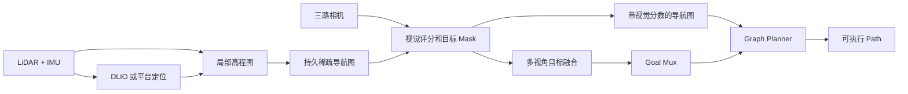
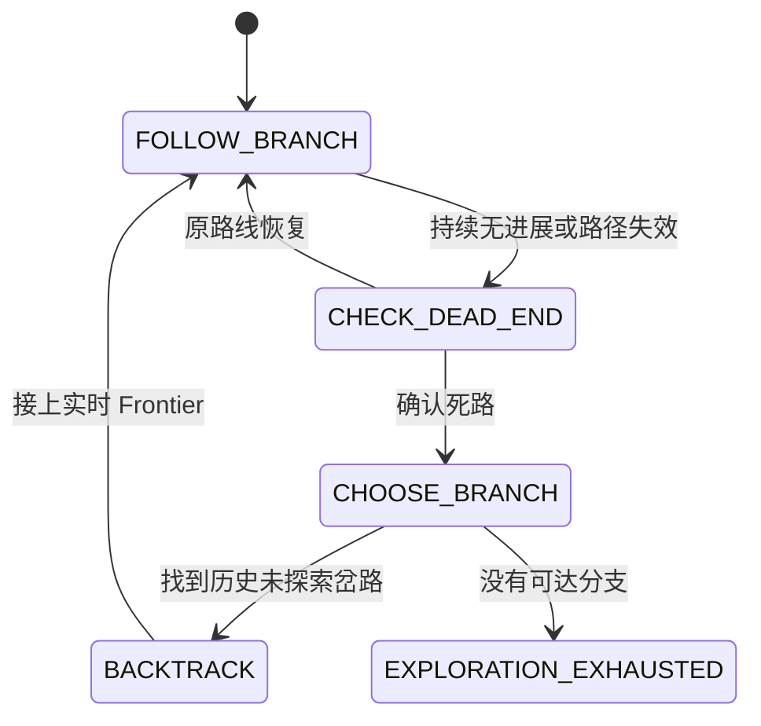
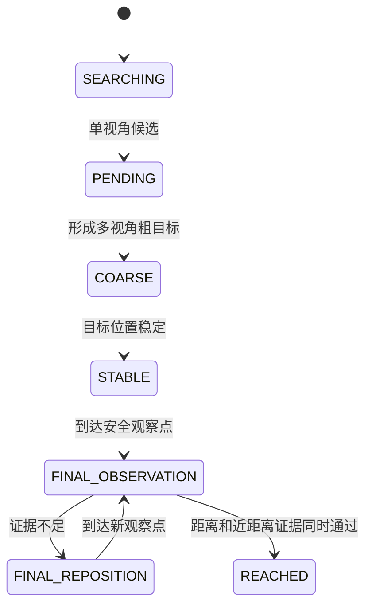
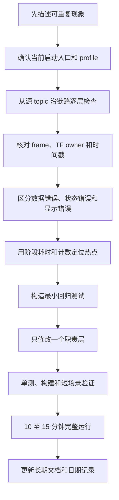

# 从局部高程图到目标搜索, WildOS 导航链路问题总结

> 本文整理 2026-06-23 至 2026-07-29 的日期文档, 将同类问题合并说明
>
> 历史文档记录的是当时的判断, 本文中的“当前方案”以 `docs/details/` 和 2026-07-27 之后的结论为准

## 1. 这套系统要解决什么问题

WildOS 面向一种很常见、也很困难的机器人任务: 机器人只知道要找什么, 但不知道目标在哪里, 也没有完整地图

机器人需要一边移动、一边完成以下工作:

1. 使用 LiDAR 和 IMU 估计自身位置
2. 从局部高程图判断附近哪里能走
3. 把已经确认安全的路线保存成长期导航图
4. 使用三路相机判断哪些未知方向更值得探索
5. 看到目标后, 从多个视角估计目标的三维位置
6. 规划到安全观察点, 完成近距离确认后停止

这不是一个单独算法可以解决的问题, 真正困难的是让地图、坐标、视觉、规划和状态机长期保持一致

## 2. 当前主链路



当前只有一条默认几何主线:

```text
PointCloud2 + odom / TF
  -> elevation_mapping_cupy
  -> elevation GridMap
  -> graph_construction
```

早期 2D `OccupancyGrid`、旧视觉射线粗定位、旧 batch triangulation 和默认 `cmd_vel` 控制链路都已经退出当前主线

## 3. 核心需求

### 3.1 地图必须区分“看不见”和“不能走”

- `free` 表示当前确认可以通行
- `obstacle` 表示当前确认不能通行
- `unknown` 只表示当前看不见

机器人走远后, 旧区域会滑出局部地图并重新显示为 unknown, 但这不能直接否定以前确认过的安全路线

### 3.2 导航图必须稳定

- 历史节点 UUID 不能每帧变化
- 新障碍必须删除冲突节点和边
- 当前看不见的历史安全边应继续保留
- 新节点只能生成在机器人真实可达的 free 区域
- 对外仍发布完整图, 内部更新应只处理变化区域

### 3.3 探索目标不能频繁变化

相邻 Frontier 的视觉分数可能很接近, 如果每帧都重新选择, 机器人会左右转向却很少前进

因此系统需要记住当前走廊、走过的边、失败的方向和待探索岔路, 只有当前路线失效或确认无进展时才换路

### 3.4 看到目标不等于知道目标位置

单张图像通常只能确定方向, 不能可靠确定距离

系统必须区分:

- 单视角候选
- 多视角粗目标
- 稳定视觉目标
- LiDAR 锁定目标
- 最终完成

### 3.5 所有数据必须处于同一时空坐标

点云、IMU、相机、odom 和 TF 不仅要使用正确 frame, 还要使用正确时间

只修改消息中的 `frame_id` 并不等于完成坐标变换, 使用回调时的最新 TF 也不能代替测量时刻的 TF

## 4. 开发过程概览

| 时间 | 主要阶段 | 最终沉淀 |
|---|---|---|
| 06-23 至 06-26 | 建立图构建、视觉评分和运动执行的分阶段方案 | 明确几何地图与三相机视觉必须解耦 |
| 07-01 至 07-03 | 排查高程图范围、偏移、rolling 坐标和 Unity TF | 统一 GridMap 解码、坐标变换和 profile 配置 |
| 07-06 至 07-09 | 打通目标搜索, 修复路径延迟、旋转和穿障碍问题 | 2.5D 高程图成为默认主线, Planner 只输出安全图路径 |
| 07-13 至 07-16 | 建立持久图、探索记忆、多视角定位和路径去抖 | 路线不再因瞬时分数或 UUID 变化频繁切换 |
| 07-17 至 07-20 | 接入 DLIO, 增加健康恢复和启动盲区修补 | 定位异常时暂停下游, 启动安全先验不跟随机器人移动 |
| 07-21 至 07-27 | 系统化分析性能、图孤岛和边更新 | 使用 free radius 稀疏采样和 dirty pair 增量更新 |
| 07-29 | 评估 Orin 性能并拆分双主机 Docker 部署 | x86 负责传感器和定位, Orin 负责建图、视觉和规划 |

下面不再按日期展开, 而是按不同问题分别说明

## 5. 问题一, 高程图范围小、偏移或不显示

### 问题表现

- 原始点云范围很大, 高程图只有机器人附近一小块
- 高程面出现竖直幕布、深坑或镜像
- GridMap topic 有 publisher, 但没有有效数据
- 高程图和导航节点整体错位
- 机器人转向后地图像是跟着旋转

### 容易犯的错误

最常见的低级误判是看到高程图比点云小, 就直接增大 ray length 或地图尺寸

实际上, 高程图本来就是 rolling local map, 点云能看到 70 m, 不代表局部地图也应保存 70 m

另一个常见错误是改写点云 `frame_id`, 却没有真正执行 TF 变换, 这会把坐标错误伪装成已经对齐

### 真正原因

这一类问题最终归并为四种原因:

1. `map_length` 限制局部地图尺寸, 这是正常设计
2. 点云轴向错误, 例如错误翻转 Z 轴会把高处建筑变成地下深坑
3. TF 链不完整或 frame owner 冲突, elevation mapping 无法把点云转换到地图坐标
4. GridMap 是 circular buffer, 忽略起始索引、yaw 或数组布局会造成坐标错位

### 排查思路

按数据源到结果逐层检查:

```text
原始点云是否有正确地面
  -> 点云 header.frame_id 是否真实
  -> map 到 sensor 的 TF 是否存在
  -> elevation GridMap 是否持续发布
  -> finite elevation cell 是否足够
  -> GridMap center、yaw、buffer index 是否正确
  -> world_to_grid 与 grid_to_world 是否互为逆变换
```

不要一开始就调整 free 阈值、Z offset 或可视化参数, 因为这些参数无法修复错误坐标

### 解决办法

- elevation mapping 保留点云真实 frame, 通过 TF 完成坐标变换
- 用 profile 分别配置 Unity、Isaac 和 robot 的 topic 与 frame
- GridMap 解码统一支持 `data_offset`、两种数组布局和 circular buffer 展开
- 坐标转换显式处理 GridMap center、尺寸和 yaw
- `world_to_grid` 与 `grid_to_world` 增加 90 度 yaw round-trip 测试
- 2.5D elevation `GridMap` 成为唯一默认几何输入

### 当前结论

高程图比远距点云小是正常现象, 真正需要关注的是地图覆盖范围内的有效地面比例、frame 一致性和坐标正逆变换

## 6. 问题二, 机器人脚下是空洞, 导航图形成孤岛

### 问题表现

顶部 LiDAR 很难看到机器狗正下方, 启动时机器人附近可能是一片 unknown

早期方案只填充固定 4 m 圆, 当实际盲区更大时, 人工 free 圆和外围真实 free 之间仍有一圈 unknown

结果是:

```text
脚下人工 free 岛
  -> unknown 环
  -> 外围真实 free
```

地图看起来已经有地面, 但 current node 仍无法通过导航图到达外围节点

### 难点

unknown 不能随意当作安全区域, 否则机器人可能穿过真实障碍

但完全不补 unknown, 机器人又无法从启动点离开

因此这是一个受约束的启动假设, 不是通用补洞算法

### 排查思路

需要同时检查两个层级:

1. 栅格层, 机器人脚下 free 分量是否接触外围真实 free
2. 图层, current node 是否能通过安全边到达外围真实节点

只检查“全图有节点和边”是不够的, 还必须从 current node 做 BFS 检查实际图分量

### 解决办法

- 4 m 只作为盲区种子范围
- 在 12 m 搜索范围内, 填满与脚下种子或已有 free 岛相连的 unknown 分量
- 只有接到搜索边界上的原始 free 后, 才认为启动修补完成
- 人工区域保存为固定世界坐标, 不跟随机器人持续移动
- 后续点云确认 obstacle 时, 必须覆盖人工 free 并删除冲突节点和边
- 新节点只在机器人所在的真实可达 free 分量中生成
- 图更新结束后从 current node 执行 BFS, 统计图分量和局部连通性

### 当前结论

启动先验只解决初始传感器盲区, 不能扩展成“机器人走到哪里就把哪里补成 free”

当前仍需在 Unity 中确认脚下图能够稳定接入外围真实地图, 并验证新障碍可以覆盖人工区域

## 7. 问题三, 节点过密、边过多, 图更新越来越慢

### 问题表现

长时间运行后, 导航图节点和边持续增加

优化前约 500 个节点时:

- 图更新平均约 376 ms 至 425 ms
- 边更新平均约 245 ms 至 264 ms
- graph 消息年龄 P95 接近 1 s

RViz 中还会出现大量交叉红线, 看起来像局部全连接图

### 根因

早期边更新把很小的地图变化扩大成大量节点和候选 pair:

```text
少量变化 cell
  -> 查询附近大量节点
  -> 每个节点重新找邻居
  -> 重复执行大量走廊安全检查
```

同时, unknown blocked candidate 和低连接重试状态会随历史积累, 让一次局部变化唤醒大量旧候选

### 难点

不能只用“每个节点最多连接几条边”来强行降耗

这种做法虽然能减少边数, 却可能删掉关键通路, 使图在狭窄区域断开

性能优化必须保持同一条安全拓扑规则, 只减少重复计算

### 排查思路

性能分析不能只看总耗时, 应拆开记录:

- 地图分类时间
- 节点采样时间
- candidate pair 数量
- clearance check 数量
- edge delta 数量
- 消息转换和发布时间
- 平均值、P95 和最大值

还要区分首帧完整构图、地图变化帧和稳定复用帧

### 解决办法

节点侧:

- 使用 free radius 随机采样
- 候选落入已有节点安全自由圆时直接拒绝
- 新增 free 使安全圆扩大时, 只压缩变化区域附近的重叠旧节点
- 不恢复移动 anchor 和 breadcrumb 节点

边侧:

- 首帧使用 `cKDTree.query_pairs()` 建立完整局部半径图
- 新增节点只检查自己的 incident pair
- 新 obstacle 只复查经过变化区域的历史边
- unknown 变 free 只生成变化 cell 附近可能受影响的 pair
- free 变 unknown 时保留历史安全边, 不批量重算
- 稳定帧 pair 数和 clearance check 数都应为 0
- 只对 edge delta 更新邻接表和空间索引

### 当前效果

2026-07-27 的合成压力测试中:

| 场景 | pair 检查 | `builder.update` |
|---|---:|---:|
| 首帧完整构图 | 13497 | 约 642 ms |
| 相同地图稳定帧 | 0 | 约 17 ms |
| 单个新 obstacle | 1527 | 约 70 ms |

这些是合成测试, 不能替代 Unity 10 分钟完整运行

下一步需要确认节点密度、消息年龄和完整消息转换是否成为新的瓶颈

## 8. 问题四, 路径穿过障碍或突然消失

### 问题表现

- 可视化路径最后一段直接穿过 unknown 或障碍
- 斜边从障碍角点擦过
- rolling map 滑动后, 走过的节点、边和路径消失
- 当前节点落在 unknown 中, Planner 从虚构起点开始规划

### 根因

历史上有三个问题混在一起:

1. virtual goal 被追加到可执行 Path, 目标位于 unknown 外时会出现一条虚假直线
2. 边只检查 Bresenham 中心线, 没有检查机器人所需净空
3. 把 unknown 当成障碍删除历史图, rolling map 移动后安全路线也被删掉

### 解决办法

- virtual goal 只参与 Frontier 排序, 默认不追加到可执行 Path
- Frontier point 只提供探索方向, 执行路径停在安全 graph node
- 边检查 obstacle、unknown 和 clearance corridor
- 斜线使用正反两条栅格线合并成保守 supercover, 防止漏掉角点
- obstacle 删除冲突历史边, unknown 保留已经确认安全的历史边
- current node 优先选择附近安全普通节点
- 只有机器人脚下明确为 free 时才允许创建兜底普通节点
- 图更新异常时保留上一张完整有效图

### 当前结论

执行路径必须完全落在安全导航图上, 方向提示点和真实可执行落脚点不能混为一谈

## 9. 问题五, Frontier 和路线频繁切换, 机器人原地转圈

### 问题表现

目标还未出现时, Planner 在左右 Frontier 之间快速切换, 下游不断收到新路径

机器人主要在原地转向, 实际位移很小, 甚至在走廊角落反复前后移动

### 根因

- 把高频变化的视觉候选直接当成导航 goal
- 只按 Frontier UUID 判断路线身份, UUID 小变化就被当成新路线
- 路口多条候选共享机器人附近的公共前缀, 被错误识别为同一走廊延伸
- 只记一个失败 Frontier, 新 UUID 可以绕过失败冷却
- 单帧 edge 消失就释放路线
- 路线更新时把新尾段追加到旧路线, 形成先前进再返回的 U 形路径

### 难点

路线不能太敏感, 也不能完全锁死

如果切换太快, 机器人只会转向, 如果锁定太久, 真正的障碍、死路或目标出现后又无法及时接管

### 解决办法

当前探索状态机分为:



具体措施:

- `ActiveBranch` 保存当前走廊的有序节点序列和路径进度
- 只有候选有序经过旧尾节点并继续向前, 才算同一走廊延伸
- 普通路线至少保持 2.5 s
- Frontier 移动不足 0.75 m 时不重新发布路径
- 路径 edge 连续 3 帧、持续 1.5 s 消失后才判定失效
- 无进展先经过 20 s 启动宽限, 再持续 12 s 才释放
- 相同位置和方向的失败走廊合并, 即使 UUID 变化也共享冷却
- 每次执行当前节点到新 Frontier 的最新 Dijkstra 简单路径, 不追加旧尾段
- 明显回头只允许发生在 `BACKTRACK`
- 目标出现时可以立即抢占, 不受普通路线保持时间限制

### 当前效果

约 10 分钟 Unity 运行中, 系统可以持续前向探索、确认死路后恢复历史分支, 并在目标出现后让出控制

仍应通过新日志持续检查普通回头次数、路线切换频率和狭窄区域绕障是否被误拦截

## 10. 问题六, 视觉检测存在, 但目标位置漂移

### 问题表现

- 目标 Mask 已经出现, 机器人仍继续远距离探索
- 单视角粒子均值被误当成目标坐标
- 粗目标落在机器人几十米外或地下
- 目标 marker 抖动, 导航 goal 反复变化
- LiDAR 精修点太少, 或背景点被误认为目标

### 根因

单张图像只能提供一条目标方向射线, 深度范围内的所有点都可能是目标

如果直接取粒子均值, 或只检查视角数和置信度, 一个几何上明显不合理的粗目标也可能接管导航

此外, 过大的消息缓存会让 Mask、TF 和点云来自不同时间, 正确算法也会被旧数据拖出明显偏差

### 排查思路

把“检测”和“定位”分开观察:

```text
图像分数和确认窗口
  -> Mask 发布时间和消息年龄
  -> 测量时刻相机 TF
  -> 独立视角数量和横向基线
  -> 粒子方差和置信度
  -> Mask 与点云时间差
  -> LiDAR 去地面和前景聚类点数
  -> Goal Mux 物理门控结果
```

### 解决办法

检测侧:

- 首次峰值门槛保持 0.120
- 后续确认峰值使用 0.110
- 3 帧窗口内至少 2 帧有效
- 连通区域至少 300 像素

多视角融合侧:

- 完全重复帧不累计证据
- 小横向基线的弱视角低权重参与, 但不增加独立视角数
- 至少 0.12 m 横向基线才增加独立视角数
- 0.3 m 和 3 度只是满质量参考, 不是双重硬门槛
- 第一视角只发布 bearing, 不发布可执行目标距离
- 粗目标至少需要两个独立视角和 0.45 置信度
- 同时检查 frame、30 m 最大距离、1.5 m 高度差和 8 m 水平标准差
- 稳定目标需要更高置信度和更小粒子方差

LiDAR 精修侧:

- Mask 与点云时间差不超过 0.25 s
- 同一个 LiDAR 点落入多个相机时只计算一次
- Mask 只扩张 3 像素吸收投影误差
- 至少保留 18 个 Mask 内点
- 去掉地面, 再选择靠近相机的连续前景簇
- 连续两帧位置一致后才允许进入 `LIDAR_LOCKED`

队列侧:

- 图像同步器只保留少量最新数据
- Mask 发布和融合订阅队列深度为 1
- TF 队列只保留最新待处理组
- 新数据到达时不追赶已经过期的旧图像

### 当前结论

粒子滤波器负责估计“目标在哪里”, Goal Mux 负责判断“这个估计能不能控制机器人”, 两者不能合并成一个模糊判断

当前自动化测试已覆盖重复视角、弱视角、物理门控和 LiDAR 连续性, 仍需在 Unity 验证 Mask 延迟、LiDAR 精修率和完整目标定位精度

## 11. 问题七, 到达目标附近却错误完成, 或永远无法完成

### 问题表现

早期实现容易把“到达估计坐标附近”当作任务完成

但粗目标可能仍有数米误差, 机器人到达错误位置后不应直接停止并宣布成功

### 解决办法

目标搜索拆成清晰状态:



关键规则:

- `PENDING` 只面向目标短暂停留, 必要时横向移动 0.6 m 获取第二视角
- 粗目标先到目标外约 2.75 m 的安全观察位置
- 稳定目标先到目标外约 1.75 m 的最终观察位置
- 目标丢失时只做小角度重捕获, 不执行无意义的 360 度旋转
- 定位仍不稳定时横向换观察点, 获得新的视差
- `REACHED` 必须同时满足稳定目标、2 m 距离门槛和新鲜近距离视觉证据, 或新鲜 `LIDAR_LOCKED`
- 完成后由 Goal Mux 永久锁定, 其他模块不能重新恢复探索

### 当前结论

最终观察和完成门控已经通过自动化测试, 当前缺口是 Unity 完整闭环验收

## 12. 问题八, DLIO、TF 和时间同步不一致

### 问题表现

- 地图重影或随时间逐渐旋转
- 相机投影越来越偏
- TF 出现重复 child frame
- DLIO 短暂异常后, 错误点云继续污染高程图
- 仿真启动时出现 TF 向过去外推失败

### 根因

- Unity 真值 odom 和 DLIO 同时持续控制主位姿
- 点云、odom 和 TF 来自不同位姿源
- LiDAR 和 IMU 外参方向或单位错误
- IMU 频率、逐点时间或时钟基准不正确
- 多个节点发布同一个 child frame
- Python 高频转发造成额外延迟和时间戳问题

### 解决办法

- Unity 真值 odom 只在启动时计算一次固定对齐, 运行位姿完全来自 DLIO
- DLIO 直接订阅原始 LiDAR 和 200 Hz 目标 IMU, 不使用 Python 高频转发
- 点云 header 时间用于帧同步, 逐点时间用于运动去畸变
- canonical odom、TF 和对齐点云来自同一 DLIO 位姿源
- Unity 真值 TF 与 DLIO TF 隔离
- 每个 child frame 只有一个 TF owner
- DLIO 健康失败时暂停下游输出, 恢复后再继续
- 错误位姿已经污染高程图时, 修复输入后重启地图

### 排查思路

低频日志把方向问题分成:

- 启动原始方向差
- 对齐后的当前方向差
- 相对启动时的累计变化
- 本次运行最大方向差

固定初始偏差可以用一次对齐消除, 随时间增长的差值才是漂移

### 当前问题

DLIO 自动化测试已通过, 但与 Unity 参考 odom 约 10 至 16.6 度的累计方向差仍需结合完整运行日志继续排查

## 13. 问题九, 启动、配置和部署难以维护

### 问题表现

- 同一平台存在多个相似 launch 和脚本
- 源码已经修改, 运行进程却仍加载旧 install tree
- 旧进程、旧 TF 或旧 publisher 残留, 导致看似随机的冲突
- Unity、Isaac 和实机通过复制 launch 维护, 配置逐渐不一致
- x86 和 Orin 重复运行定位或发布相同 TF

### 解决办法

- 默认入口统一为 `scripts/start_wildos_elevation.sh`
- 平台差异集中到 `topic_profiles.yaml`
- 算法参数保留在所属模块配置, 固定实现值改为代码常量
- 启动脚本阻止重复启动第二套同名主链路
- 运行前确认加载的是主 workspace 的最新 install tree
- x86 主机运行 LiDAR、IMU 和 DLIO
- Orin 运行三相机、高程图、导航图、视觉和 Planner
- 两台主机使用相同 ROS domain、RMW 和系统时间
- 三台相机按序列号绑定 front、left、right, 不依赖 `/dev/videoN`

### 性能预算

Orin 三相机模型 500 次持续推理的 P95 约为 45.3 ms

相机继续发布 15 Hz, 视觉处理限制为 10 Hz, 只处理最新同步帧, 为 CuPy 高程图和其他 GPU 工作留出余量

跨主机 `/cloud_registered` 是主要带宽风险, 应避免同一监控节点重复订阅, 并实测消息大小、频率、网络吞吐和消息年龄

## 14. 这些问题中最难的部分

### 14.1 局部地图和长期记忆的边界

局部地图会滚动, 历史路线却不能消失

系统必须做到:

- obstacle 可以否定历史路线
- unknown 不能随意否定历史路线
- 当前 Frontier 不能变成永久拓扑
- 历史岔路又必须被 Planner 长期记住

### 14.2 稳定性和响应速度的平衡

地图和视觉每帧都有噪声, 路线不能跟着抖动

但真正出现障碍、目标或定位异常时, 系统又必须立即响应

因此不同事件需要不同去抖规则, 不能使用一个统一延时解决全部问题

### 14.3 多传感器的时间一致性

每条数据单独看都可能正确, 但如果 Mask、TF 和点云相差一秒, 融合结果仍然是错的

排查时必须记录 source time、receive time、processing time 和 publish time, 不能只看 topic 是否存在

### 14.4 性能优化不能破坏安全语义

少算一些 pair 很容易, 难的是在少算之后仍保证:

- 新障碍能删除危险边
- 新 free 能连接旧区域
- unknown 不会生成虚假新边
- 历史安全图不会随 rolling map 消失

## 15. 推荐的通用排查方法



排查时建议坚持以下原则:

1. 先确认运行的是哪套代码, 再分析算法
2. 先检查原始输入, 再检查中间结果
3. 先检查 frame 和时间, 再调整阈值
4. 区分 RViz 显示错误和真实数据错误
5. 只使用一次短日志不能证明长期性能
6. 合成测试通过不能替代完整闭环验证
7. 每个修复都要覆盖正常路径和失败路径

## 16. 当前完成情况

| 模块 | 已完成 | 仍需验证 |
|---|---|---|
| 导航图 | free radius 采样、持久节点、dirty pair 增量边更新、图分量统计 | Unity 10 分钟性能和连通性回归 |
| 启动地图 | 固定世界坐标启动先验、12 m 连通盲区恢复 | 多次重置和真实障碍覆盖 |
| 探索路线 | 分支状态机、失败走廊记忆、路线保持和发布去抖 | 更多狭窄场景与普通回头统计 |
| 视觉检测 | 0.120 / 0.110 双门槛和最新帧队列 | 无目标场景 10 分钟误检测试 |
| 目标定位 | 多视角软权重、物理门控和 LiDAR 连续性保护 | Mask 延迟、LiDAR 精修率和外参精度 |
| 最终完成 | 最终观察、换位和 `REACHED` 门控 | Unity 端到端闭环 |
| DLIO | 主链接入、TF 隔离和健康暂停恢复 | 累计方向差来源 |
| 部署 | x86 与 Orin 拆分方案和容器健康检查 | 现场相机、时钟、DDS 带宽和持续负载 |

## 17. 总结

这段开发过程最重要的结果, 不是增加了多少参数或状态, 而是逐步建立了清晰的职责边界:

- 高程图只描述附近当前地面
- 导航图保存长期安全路线
- WildOS 负责视觉证据
- 目标融合负责目标位置
- Goal Mux 负责高层状态和最终完成
- Planner 只在安全图上生成路径
- DLIO 和 TF 提供统一时空基准

当这些边界清楚后, 很多看似随机的问题都可以被准确归类

地图错位先查坐标, 路线抖动先查状态和记忆, 目标漂移先查视角与时间, 性能下降先查重复计算, 而不是继续叠加临时补丁

## 18. 主要参考文档

### 当前实现

- [系统概览](../details/overview.md)
- [实现原则](../details/principles.md)
- [导航图更新](../details/graph_update.md)
- [目标搜索与探索路线](../details/target_exploration.md)
- [目标定位与视觉雷达融合](../details/target_localization.md)
- [DLIO 坐标与 TF](../details/dlio.md)
- [环境配置](../details/environment.md)
- [Docker 部署说明](../details/docker_deployment.md)

### 关键历史记录

- [高程图范围和偏移](../2026-07-01/2026-07-01-elevation-map-range-offset-analysis.md)
- [GridMap rolling 坐标](../2026-07-03/2026-07-03-gridmap-rolling-coordinate.md)
- [目标搜索稳定性方案](../2026-07-08/2026-07-08-object-search-principle-and-stability-plan.md)
- [2.5D 高程图主线化](../2026-07-09/2026-07-09-elevation-backend-as-primary.md)
- [持久图与探索记忆](../2026-07-13/2026-07-13-persistent-graph-and-exploration-memory.md)
- [探索走廊循环修复](../2026-07-16/2026-07-16-exploration-corridor-loop-fix.md)
- [目标定位偏移修复](../2026-07-16/2026-07-16-object-target-localization-hardening.md)
- [DLIO 接入方案](../2026-07-17/2026-07-17-dlio-integration-plan.md)
- [启动盲区修复](../2026-07-20/2026-07-20-elevation-startup-blind-zone-fix.md)
- [导航图性能优化](../2026-07-22/2026-07-22-graph-performance.md)
- [启动孤岛与边性能](../2026-07-27/2026-07-27-startup-island-and-edge-performance-todo.md)
- [Orin 性能预算](../2026-07-29/2026-07-29-orin-performance-budget.md)
- [双主机 Docker 部署](../2026-07-29/2026-07-29-split-docker-deployment.md)
