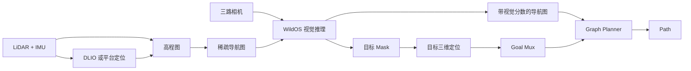

# WildOS 系统概览

> 本文只说明当前主线, 历史方案请查看按日期归档的文档

## 1. 系统要做什么

WildOS 让机器人在不知道目标坐标时完成以下任务:

1. 使用 LiDAR 和 IMU 估计机器人位置
2. 从局部高程图判断哪里能走
3. 把走过的区域保存成稀疏导航图
4. 使用三路相机给未知区域打分
5. 发现目标后估计目标的三维位置
6. 规划到目标附近并完成近距离确认

## 2. 当前主链路



当前唯一几何地图输入是 elevation `GridMap`, 不再支持旧的 2D `OccupancyGrid` 后端

## 3. 模块职责

| 模块 | 负责什么 | 不负责什么 |
|---|---|---|
| `elevation_mapping_cupy` | 生成局部高程和可通行地图 | 长期保存探索路线 |
| `graph_construction` | 把局部地图更新成持久导航图 | 视觉推理和路径搜索 |
| WildOS | 视觉评分、目标 Mask 和近距离视觉证据 | 目标三维坐标和最终完成判定 |
| `object_target_fusion` | 融合多视角 Mask 和 LiDAR | 决定机器人是否停止 |
| `TargetParticleFilter` | 计算目标位置、方差和置信度 | ROS topic 和导航状态 |
| `ObjectSearchGoalMux` | 统一选择探索、观察、目标接近和停止状态 | 计算 graph 路径 |
| `graphnav_planner` | 在导航图上计算可执行路径 | 底盘运动控制 |

`ObjectSearchGoalMux` 是高层目标和任务完成状态的唯一 owner

## 4. 当前数据分层

```text
局部高程图
  -> 只描述机器人附近的当前地面

持久导航图
  -> 保存走过的安全节点、边和当前 Frontier

视觉评分图
  -> 在导航图上增加视觉方向分数

目标估计
  -> 保存目标位置、误差范围和融合状态

规划路径
  -> 当前需要执行的节点序列
```

## 5. 默认启动

```bash
./scripts/start_wildos_elevation.sh
```

启用目标搜索:

```bash
WILDOS_TOPIC_PROFILE=unity \
  ./scripts/start_wildos_elevation.sh do_object_search:=true
```

默认 profile 是 `unity`, 可用 profile 为:

- `unity`: Unity 仿真
- `isaac`: Isaac Sim
- `robot`: 机器狗 Orin D-LIO 和新 Orin WildOS 实机部署

统一集成 launch:

```text
graph_construction/launch/elevation_visual_navigation_sim.launch.py
```

## 6. 配置放在哪里

| 配置内容 | 文件 |
|---|---|
| 平台 topic、frame、ROS domain | `graph_construction/configs/topic_profiles.yaml` |
| Unity DLIO frame、外参和配准参数 | `graph_construction/configs/dlio/unity.yaml` |
| 实机 DLIO 参数 | `.env.orin.lidar-dlio` 或 `.env.x86_64.lidar-dlio` 指向的现场 YAML |
| 高程图范围、更新率和启动先验 | `graph_construction/configs/elevation_mapping_sim.yaml` |
| 高程图解码和导航图 ROS 参数 | `graph_construction/configs/graph_construction_elevation.yaml` |
| 导航图算法默认值 | `GraphBuilderConfig` |
| WildOS 模型和视觉阈值 | `visual_navigation/configs/wildos_nav_*.yaml` |
| 目标搜索状态机 | `visual_navigation/configs/object_search_goal_mux.yaml` |
| Planner | `graphnav_planner/config/planner.yaml` |

修改平台差异时优先修改 profile, 不复制新的集成 launch

## 7. 详细说明

- [导航图更新](graph_update.md)
- [目标搜索与探索路线](target_exploration.md)
- [目标定位与视觉雷达融合](target_localization.md)
- [Topic 契约](topics.md)
- [环境配置](environment.md)
- [实现原则](principles.md)

## 8. 当前未完成事项

当前主链路已经可以运行, 但以下内容仍需完成:

- 导航图优化后的 Unity 10 分钟性能回归
- 用新日志确认普通探索路线的回头和切换频率
- 验证同步和队列改造后约 1.2 s 的目标 Mask 延迟是否下降
- 验证近距离 LiDAR 目标精修成功率是否提高
- 验证稳定目标经过最终观察后能在完整场景进入 `REACHED`
- 排查 DLIO 与 Unity 参考里程计的累计方向差
- 完成多场景和无目标场景验收

最终观察、横向换位和 `REACHED` 门控已经完成代码与自动化测试, 当前缺口是 Unity 端到端验收

详细进度见 `docs/2026-07-23/2026-07-23-todo.md`

## 9. 不属于当前主线

以下内容保留用于研究对照, 默认集成 launch 不启动:

- LRN、ImgFrontier 和 GeoFrontier
- ExploRFM 训练代码
- GPS 记录和可视化工具
- `path_follower_node` 实验适配器
- 历史 2D 建图和旧 triangulation 演示
