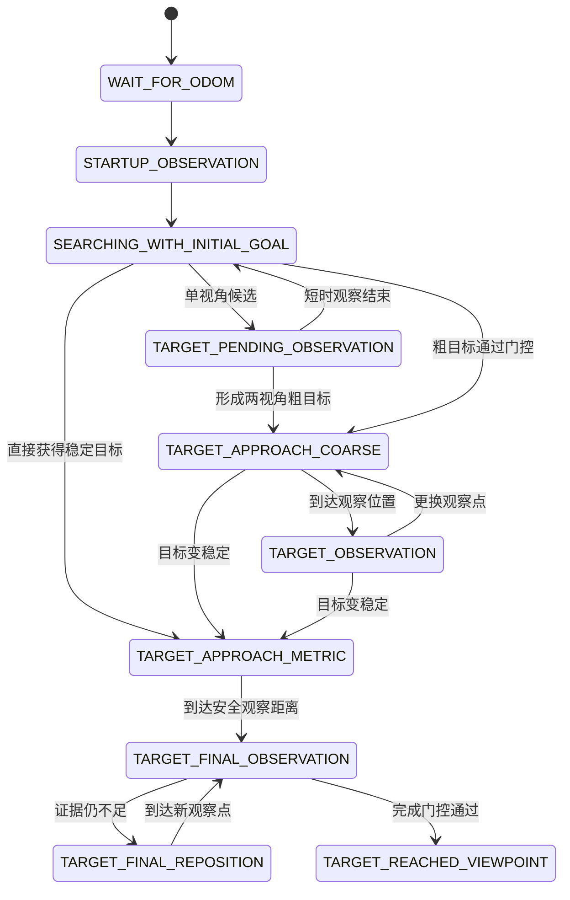
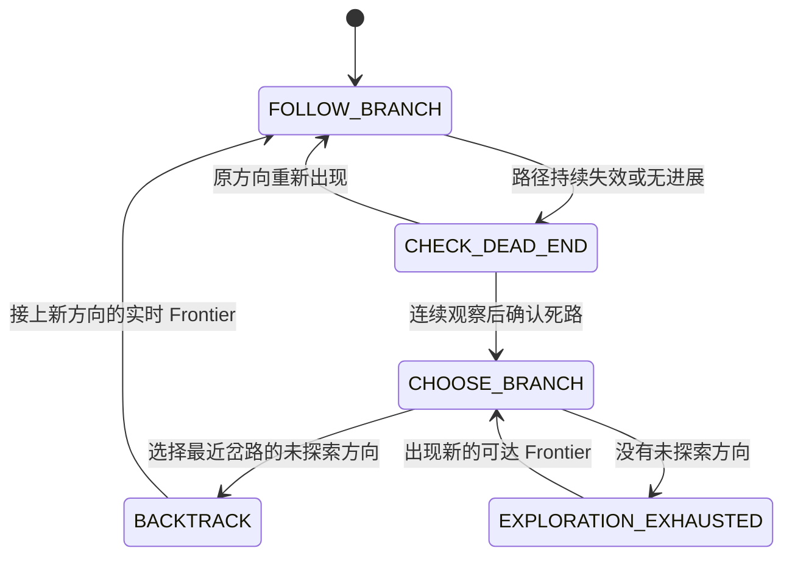

# 目标搜索与探索路线

> 更新时间: 2026-07-23

## 1. 这个模块做什么

任务开始时只有文本目标, 没有目标坐标

系统需要先探索, 看到目标后切换到目标观察和接近, 最后完成近距离确认

本模块回答:

1. 还没看到目标时往哪里走
2. 看到目标后何时停止探索
3. 粗目标、稳定目标和最终完成如何切换

目标坐标如何计算见 [目标定位与视觉雷达融合](target_localization.md)

## 2. 模块分工

| 模块 | 职责 |
|---|---|
| WildOS | 给 Frontier 打分、检测目标、生成近距离视觉证据 |
| `object_target_fusion` | 计算目标三维位置和稳定性 |
| `ObjectSearchGoalMux` | 选择当前高层目标和任务状态 |
| `graphnav_planner` | 在 scored graph 上计算路径 |
| 外部控制器 | 执行 Path 和底层避障 |

Goal Mux 是高层目标和最终完成状态的唯一 owner

## 3. 状态流程



| 状态 | 通俗说明 |
|---|---|
| `WAIT_FOR_ODOM` | 等待机器人位置 |
| `STARTUP_OBSERVATION` | 等地图和视觉评分稳定 |
| `SEARCHING_WITH_INITIAL_GOAL` | 按初始方向探索 |
| `TARGET_PENDING_OBSERVATION` | 保持位置并面向单视角候选 |
| `TARGET_APPROACH_COARSE` | 接近粗目标的安全观察位置 |
| `TARGET_OBSERVATION` | 面向粗目标观察或换位 |
| `TARGET_APPROACH_METRIC` | 接近稳定目标外的安全观察点 |
| `TARGET_FINAL_OBSERVATION` | 面向稳定目标做最终确认 |
| `TARGET_FINAL_REPOSITION` | 横向更换最终观察点 |
| `TARGET_REACHED_VIEWPOINT` | 完成门控通过, 停止任务 |

## 4. 启动观察

启动后不会立即发送远距离路线, 也不会默认旋转 360 度

Goal Mux 先等待:

- 预热约 3 s
- 连续有效导航图
- 连续有效 scored graph
- 图消息没有过期
- 前方存在可规划节点和 Frontier

前方可规划时直接开始探索

只有连续多帧确认前方不足时, 才左右小角度观察并回到初始朝向

启动观察期间不累计探索失败时间

## 5. 初始方向如何工作

Goal Mux 根据第一帧 odom 和配置方向生成远距离虚拟 goal

这个 goal 只用于告诉 Planner 主要探索方向, 不是必须踩到的固定坐标

机器人前进后, 虚拟 goal 会沿同一方向继续向前移动, 避免旧 goal 落到身后导致掉头

Planner 对每个可达 Frontier 综合考虑:

- 路线是否连通
- 路线长度和可通行代价
- 是否重复经过旧边
- 沿初始方向前进多少
- 需要回退多少
- Frontier 视觉分数

virtual goal 只参与候选排序, 不会被追加成穿过 unknown 的执行路径

## 6. 探索状态机

底层仍使用 Dijkstra 计算当前位置到选定节点的最短路径

状态机只决定当前探索哪个方向, 以及什么时候允许回头



| 状态 | 行为 |
|---|---|
| `FOLLOW_BRANCH` | 沿当前方向持续前进 |
| `CHECK_DEAD_END` | 停止换路, 等待连续有效地图确认 |
| `CHOOSE_BRANCH` | 从岔路记忆中选择未探索方向 |
| `BACKTRACK` | Dijkstra 沿历史安全图返回岔路并进入新方向 |
| `EXPLORATION_EXHAUSTED` | 没有已知可达分支, 等待新地图 |

## 7. 路线和岔路记忆

### ActiveBranch

当前正在执行的走廊

只要路线仍有效并持续有进展, Planner 优先延伸它, 不因附近 Frontier 分数轻微变化立即换路

每次发布新路线后至少保持 2.5 s

以下情况不需要等待保持时间:

- 已提交路径连续确认失效
- Goal Mux 切换到粗目标或稳定目标
- 正在恢复的历史分支到达入口后需要接上实时 Frontier

Frontier 位置移动不足 0.75 m 时继续执行原路线, 等累计移动达到门槛后再更新

### JunctionRecord

保存发现侧向分支时的图节点和世界位置

岔路按发现顺序压入栈中, 死路后优先处理最近发现的岔路

### BranchRecord

保存岔路处尚未探索的大方向

方向按 8 个扇区归并, 身份由“岔路 UUID + 方向扇区”组成

同一方向内 Frontier UUID 变化只更新实时入口, 不创建新的长期分支

### FailedBranch

已经确认失败的走廊

相同位置和方向的失败记录会合并并进入冷却, 避免新 UUID 绕过失败记忆

## 8. 如何判断路线有进展

系统检查真实执行路线, 不只看世界坐标某一个方向:

- 是否进入下一段路径
- 已走路径弧长是否增加
- 是否更靠近下一个路点
- 实际移动是否朝向下一段路线

任意一项明显改善都会刷新进展时间

这样允许正常绕障和短暂侧移

## 9. 如何限制普通回头

首次选择路线时允许最多 2.0 m 的局部绕行, 避免狭窄区域因第一段短暂向侧后方而无路可走

路线开始执行后, 每次普通延伸使用更严格规则:

- 相对当前路线最多新增 1.25 m 回退
- Frontier 相对机器人最多落后 0.5 m
- 必须属于当前路线的有序后继, 不能只共享路口附近公共路径

这三个条件只限制普通 continuation

只有状态明确进入 `BACKTRACK` 后才允许明显回头

进入新分支后, 方向基准会切换为岔路处的局部方向, 不再持续使用最初 odom 方向限制整张图

## 10. 什么时候释放路线

### 无进展

新路线先有 20 s 启动宽限, 之后连续 12 s 没有进展才释放

### 路径失效

只检查机器人尚未走过的路线段

连接边至少连续 3 帧、持续 1.5 s 消失后才确认路径失效

### 输入异常

以下情况会冻结失败计时:

- graph 过期
- odom 过期
- 目标候选正在保护
- Unity 位姿重置正在处理

## 11. 死路恢复

路线确认失败后:

1. 记录失败走廊并开始冷却
2. 进入 `CHECK_DEAD_END`, 等待约 3 s 和连续有效地图
3. 进入 `CHOOSE_BRANCH`, 从岔路栈由近到远查找未探索方向
4. 进入 `BACKTRACK`, 使用 Dijkstra 生成安全回退路线
5. 接上新方向的实时 Frontier 后回到 `FOLLOW_BRANCH`
6. 没有未探索方向时进入 `EXPLORATION_EXHAUSTED`

普通 Frontier 不能获得恢复权限

短暂空图只暂停规划, 不会清空活动分支和岔路记忆

## 12. 目标出现后如何切换

### PENDING

第一帧有效 Mask 只有方向, 深度仍不确定

系统短暂保护这份证据, 保持当前路线并冻结失败计时, 但不会让单视角目标接管导航

融合节点发布 Mask 质心射线方向, Goal Mux 丢弃不可靠的距离, 在当前位置面向目标约 1.5 s

观察后仍未形成两视角粗目标时恢复原探索分支

### 粗目标

粗目标至少需要 2 个独立视角和 0.45 置信度, 同时通过 frame、距离、高度和误差范围检查

机器人先到目标外约 2.75 m 的观察位置:

1. 面向目标静止约 2 s
2. 目标丢失时左右约 20 度重捕获
3. 仍不稳定时横向移动约 0.75 m
4. 到新位置后继续面向目标观察

目标抢占前, Planner 会暂存当前方向、活动分支、岔路栈和失败冷却记录

粗目标 3 s 没有更新时恢复这些探索记录, 不把目标观察误记成死路或已完成分支

### 稳定目标

`STABLE_VISION` 或 `LIDAR_LOCKED` 可以进入稳定目标接近

小于 0.3 m 的目标位置变化通常不会反复移动 goal

稳定目标不再把物体坐标直接当作落脚点

机器人先到目标外约 1.75 m 的安全观察点, 然后:

1. 面向目标静止确认约 2 s
2. 目标丢失时只左右约 15 度重捕获
3. 证据不足时横向移动约 0.9 m
4. 到新观察点后继续确认

## 13. 最终完成

任务完成必须同时满足:

- 当前有稳定融合目标
- 机器人与稳定目标距离不超过 2 m
- WildOS 连续近距离视觉证据仍新鲜, 或融合状态为新鲜 `LIDAR_LOCKED`

门控通过后:

1. Goal Mux 锁定完成状态
2. 发布当前位置停止目标
3. 发布 `/spot1/object_search_completed=true`
4. 融合状态进入 `REACHED`

只到达估计坐标附近不能直接宣布完成

## 14. 当前效果和问题

2026-07-22 长任务中已经确认:

- 启动观察能够进入前向探索
- 系统可以持续探索、恢复死路并发现目标
- 稳定目标接管后约 0.44 s 发布路径
- 主链路没有规划器崩溃

2026-07-23 已完成代码改进:

- 普通延伸限制新增回退和负向终点
- 路线增加 2.5 s 最短保持时间
- 小于 0.75 m 的 Frontier 移动不再重新发布路线
- 增加五个明确的探索状态
- 使用 `JunctionRecord`、`BranchRecord` 和 `ExplorationMemory` 保存岔路
- 未探索方向按岔路和方向扇区归并, 不依赖单个 Frontier UUID
- 只有 `BACKTRACK` 可以绕过普通回退限制
- 短暂空图不会清空活动路线
- 恢复新分支后使用岔路处的局部方向
- 目标观察期间暂停探索状态, 候选失效后恢复原分支
- 稳定目标使用专用安全观察点和 0.5 m Planner 到达半径
- 最终观察支持静止确认、小角度重捕获和附近换位
- 30 s 日志汇总路线变化、保持、负向拒绝、恢复和释放原因

25 项 C++ 探索路线测试通过

收到新的完整运行日志后需要检查:

- 普通路线实际回头次数是否下降
- 路线切换频率是否下降
- 狭窄区域的必要绕障是否被误拦截
- 小范围 Frontier 合并是否导致旧终点停留过久
- `BACKTRACK` 是否只在死路确认后出现

详细 TODO 见 `docs/2026-07-23/2026-07-23-todo.md`

## 15. 关键参数

| 参数 | 当前值 | 含义 |
|---|---:|---|
| `frontier_progress_start_grace` | 20 s | 新路线起步宽限 |
| `frontier_progress_timeout` | 12 s | 无进展释放时间 |
| `directional_min_forward_progress` | 0.5 m | 前向候选最低进展 |
| `directional_max_initial_backtrack` | 2.0 m | 初始路线最大回退 |
| `directional_max_continuation_backtrack` | 1.25 m | 普通延伸允许新增的最大回退 |
| `directional_min_continuation_progress` | -0.5 m | 普通延伸终点允许落后机器人的范围 |
| `frontier_route_hold_duration` | 2.5 s | 路线更新后的最短保持时间 |
| `frontier_min_update_distance` | 0.75 m | Frontier 小变化合并距离 |
| `frontier_failure_cooldown` | 60 s | 失败走廊基础冷却 |
| `branch_recovery_cost_penalty` | 3.0 | 历史分支恢复附加代价 |
| `path_invalid_confirm_duration` | 1.5 s | 路径失效持续时间 |
| `path_invalid_confirm_frames` | 3 | 路径失效连续帧数 |
| `recovery_observe_duration` | 3.0 s | 恢复前观察时间 |
| `goal_radius` | 3.0 m | 普通非目标搜索 goal 半径 |
| `coarse_goal_radius` | 0.75 m | 粗目标观察位姿到达半径 |
| `metric_goal_radius` | 0.5 m | 稳定目标安全观察位姿到达半径 |
| `final_reposition_goal_radius` | 0.35 m | 最终观察换位到达半径 |
| `final_observation_distance` | 1.75 m | 稳定目标外的观察距离 |
| `object_reached_max_target_distance` | 2.0 m | 最终完成允许的目标距离 |

## 16. 低频诊断日志

每 30 s 输出一次探索路线统计:

```text
探索路线统计, 分支变化=..., 正常延伸=..., 小变化保持=...,
负向延伸拒绝=..., 恢复=历史.../方向.../死路...,
释放=路径失效.../无进展..., 状态切换=...
```

判断方式:

- `小变化保持` 增加且 `分支变化` 下降, 说明抑制 Frontier 抖动有效
- `负向延伸拒绝` 很高且经常无路, 说明 1.25 m 可能过严
- `状态切换` 和状态原因用于确认回头前是否进入 `BACKTRACK`
- `路径失效` 或 `无进展` 持续很高, 需要继续检查地图或路线质量

## 17. 代码入口

- `visual_navigation/visual_navigation/object_search_goal_mux.py`
- `visual_navigation/configs/object_search_goal_mux.yaml`
- `graphnav_planner/src/planner.cpp`
- `graphnav_planner/config/planner.yaml`
- `visual_navigation/visual_navigation/wildos/nav.py`
