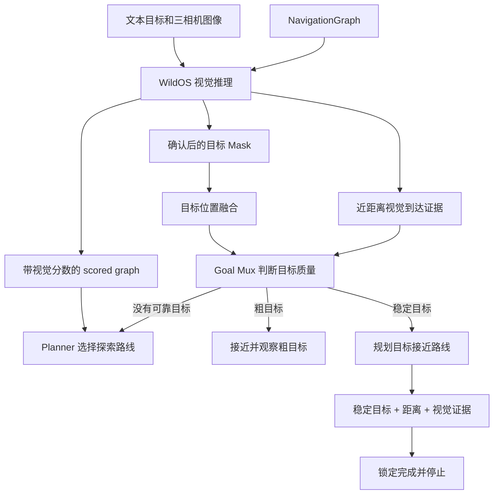
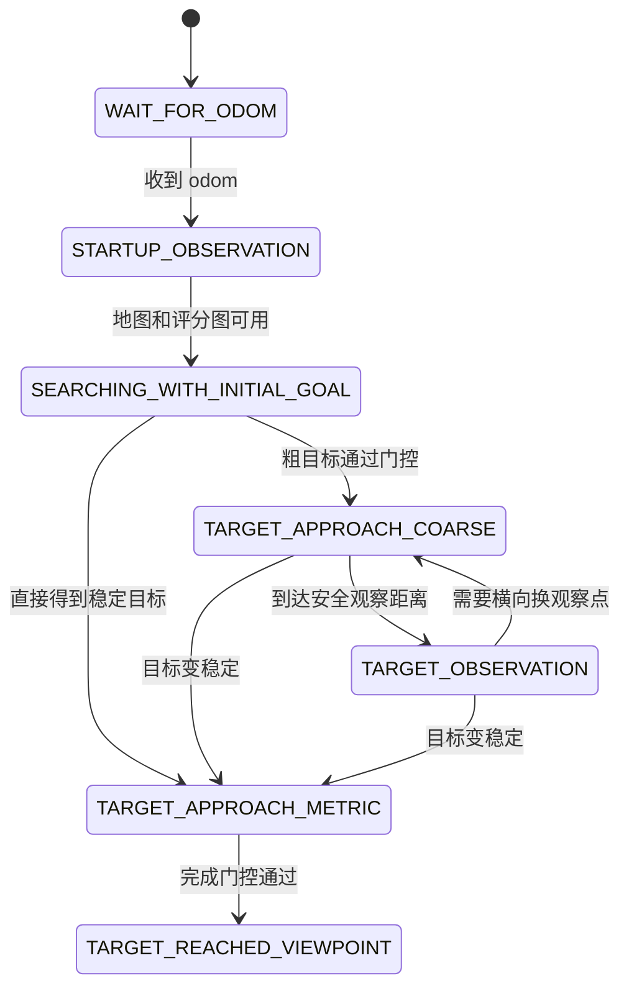

# 目标搜索与探索路线

> 状态: 当前实现说明
>
> 更新时间: 2026-07-22

## 1. 这个模块解决什么问题

目标搜索不是直接向一个已知坐标导航, 因为任务开始时系统只知道文本目标, 例如 `blue bucket`, 并不知道目标在哪里

系统需要先探索未知区域, 在相机看到目标后再从探索切换到目标接近, 最后完成近距离确认

本模块主要回答两个问题:

1. 还没找到目标时, 机器人下一步往哪里走
2. 已经有目标位置时, 谁来决定继续探索、接近目标、观察目标或停止

目标三维坐标如何计算由 `target_localization.md` 说明

## 2. 模块分工

| 模块 | 职责 |
|---|---|
| WildOS | 给 Frontier 打视觉分数, 检测目标 Mask, 生成近距离到达证据 |
| `object_target_fusion` | 把多视角 Mask 和 LiDAR 融合为目标坐标 |
| `ObjectSearchGoalMux` | 统一决定当前高层目标和任务状态 |
| `graphnav_planner` | 在 scored graph 上选择可执行路线 |
| 局部控制器 | 执行 Path, 处理底层运动和避障 |

`ObjectSearchGoalMux` 是高层 goal 和完成状态的唯一 owner, WildOS、融合节点和 Planner 都不能绕过它直接宣布任务完成

## 3. 整体流程



## 4. 搜索状态



状态含义:

| 状态 | 通俗说明 |
|---|---|
| `WAIT_FOR_ODOM` | 还不知道机器人在哪里 |
| `STARTUP_OBSERVATION` | 暂不探索, 等地图和视觉评分稳定 |
| `SEARCHING_WITH_INITIAL_GOAL` | 沿初始方向持续探索未知区域 |
| `TARGET_APPROACH_COARSE` | 已有两视角粗目标, 先走到安全观察位置 |
| `TARGET_OBSERVATION` | 面向粗目标等待、局部重捕获或准备换位 |
| `TARGET_APPROACH_METRIC` | 已有稳定三维目标, 直接规划接近路线 |
| `TARGET_REACHED_VIEWPOINT` | 完成门控已经通过, 锁定当前位置停止 |

## 5. 启动观察

启动后不立即发送远距离路线, 也不默认原地旋转 360 度

Goal Mux 先等待:

- 预热时间达到 3 s
- 连续收到足够的原始导航图
- 连续收到足够的 scored graph
- 图消息没有过期
- 前方存在足够节点和 Frontier

前向区域已经可规划时直接进入探索

只有连续多帧确认前方不足时, 才依次观察初始方向左侧和右侧的小角度区域, 最后回到初始朝向

启动观察期间 Planner 只执行同位置观察 Pose, 不创建普通探索分支, 也不累计探索失败时间

## 6. 初始方向探索

### 6.1 初始 goal 不是必须走到的固定点

Goal Mux 根据第一帧 odom 和配置方向, 在前方生成一个远距离 goal

Planner 只使用它确定固定探索方向和前视距离, 机器人前进后会把虚拟 goal 沿同一方向继续向前移动

```text
虚拟 goal = 初始起点 + 固定方向 × 当前前向进度 + 前视距离
```

这样机器人走过最初 30 m 后不会因为固定 goal 落到身后而自动掉头

### 6.2 Frontier 如何评分

对每个可达 Frontier, Planner 计算两部分代价:

```text
总代价 = 当前节点到 Frontier owner 的图路径代价
       + Frontier 指向未知区域的视觉和方向代价
```

影响选择的主要因素:

- 路线是否可达
- 路线总长度和 traversability cost
- 是否重复经过已经走过的边
- Frontier 在初始方向上的前进量
- 路线需要回退多少距离
- Frontier 方向与初始方向是否一致
- WildOS 对对应方向给出的视觉分数

Planner 使用 Dijkstra 计算图路径, virtual goal 只用于候选排序, 不会被追加成一条穿过未知区域的可执行直线

## 7. 三类探索记忆

### 7.1 ActiveBranch

ActiveBranch 是当前已经提交执行的走廊

它记录:

- 当前 Frontier UUID 和位置
- 路线节点 UUID 和路径点
- 路线尾部方向
- 开始时间和最近进展时间
- 已走到的路径段和弧长

新 scored graph 到来时, Planner 优先寻找当前走廊的延伸, 不因为相邻 Frontier 分数轻微变化就立即全局换路

### 7.2 DeferredBranch

当前没有选择的其他岔路会记录为 DeferredBranch

活动路线真正失败后, Planner 可以回到以前记住的岔路, 不需要依赖已经滑出局部地图的 Frontier 仍然存在

### 7.3 FailedBranch

确认失败的走廊会记录位置、方向和失败次数, 并进入冷却

相同 UUID 或空间位置和方向相近的失败走廊会合并, 短时间内不能立即再次选择

冷却时间会随连续失败次数增加, 当前基础值为 60 s

## 8. 如何判断路线是否有进展

当前实现不只看机器人沿初始方向前进了多少, 而是检查实际提交路径:

- 是否进入了下一段路径
- 沿路径的累计弧长是否增加
- 是否更靠近下一个路点
- 实际移动方向是否朝向下一段路线

只要其中一项有明确改善, 就刷新进展时间

这样允许机器人正常绕障或短暂侧移, 不会因为没有严格沿世界坐标直线前进而立刻判定失败

## 9. 路线何时释放

### 9.1 路径持续无进展

当前路线先有 20 s 启动宽限, 之后连续 12 s 没有实际进展才释放

### 9.2 路径失效

Planner 只检查机器人尚未走过的路线段

两个节点仍然存在但连接边连续多帧消失时, 才认为路径失效

当前要求:

- 至少连续 3 帧
- 持续至少 1.5 s

节点短暂没有出现在消息里不会直接判定路径失效

### 9.3 输入不健康时冻结时间

以下情况不会继续消耗失败计时:

- graph 过期
- odom 过期
- 目标候选证据正在保护
- Unity 位姿重置正在处理

输入恢复后重新开始连续确认, 避免 DLIO 或构图短暂停顿被误判成死路

## 10. 死路恢复

当活动分支确认失败后:

1. 记录失败走廊并开始冷却
2. 先观察约 3 s, 等待新地图和 Frontier
3. 优先恢复仍可达的历史 DeferredBranch
4. 如果仍没有前向路线, 分阶段放宽允许回退距离
5. 最大回退范围受 `dead_end_max_backtrack` 限制

明显回头应该只发生在确认死路或恢复历史分支时

## 11. 目标出现后的切换

### 11.1 PENDING 只保护证据, 不接管导航

第一帧有效 Mask 形成单视角 `PENDING` 后, Goal Mux 启用 3 s 证据保护

保护期间:

- 保持当前探索路线
- 冻结探索失败计时
- 不让单视角深度不确定的目标直接成为导航 goal

### 11.2 粗目标

粗目标需要至少 2 个有效视角、置信度不低于 0.5, 并通过坐标系、高度、距离和水平标准差门控

机器人不会直接踩到粗目标坐标, 而是在距离目标约 2.75 m 的位置停下并面向目标

观察逻辑:

1. 对准目标并静止观察 2 s
2. 目标丢失时, 围绕预测方向左右各约 20 度重捕获
3. 仍不稳定时, 沿目标切向移动约 0.75 m 形成新视差
4. 到达新观察点后重新对准观察

### 11.3 稳定目标

收到 `STABLE_VISION` 或 `LIDAR_LOCKED` 后, Goal Mux 进入 `TARGET_APPROACH_METRIC`, Planner 直接规划到稳定目标附近

稳定目标的小幅位置变化低于 0.3 m 时不会反复移动 goal

当前代码会在稳定目标进入 Planner 普通 3.0 m 半径后停止, 但不会自动转入面向目标的最终观察, 这是当前已知缺口

## 12. 最终完成门控

任务完成不能只依赖机器人和目标坐标的距离

必须同时满足:

- WildOS 发布当前近距离视觉到达证据
- 到达证据没有过期
- 当前存在稳定融合目标
- 机器人距离稳定目标不超过配置上限, Unity 当前为 2.0 m

门控通过后:

1. Goal Mux 锁定完成状态
2. 持续发布当前位置 hold goal
3. 发布 `/spot1/object_search_completed=true`
4. 融合节点收到完成通知后把状态标为 `REACHED`

完成状态是终态, 当前节点生命周期内不会因为后续 Mask 消失重新开始搜索

## 13. 当前运行结论

2026-07-22 最近一次完整运行中:

有效部分:

- 启动观察约 8.3 s 后正常进入前向探索
- 全程没有 Unity 重置和 Planner 错误
- 能够持续探索、恢复死路并最终发现目标
- 稳定目标接管后约 0.44 s 发布目标路径

仍然存在的问题:

- 9 次活动分支释放, 其中 6 次无进展、3 次路径失效
- 19 次候选路线前进量为负
- 局部 60 s 内出现 35 次路线变化
- 普通 `continuation` 仍可能把后方候选当作当前走廊延伸
- 到达稳定目标半径后直接 hold, 最终没有进入 `REACHED`

因此当前搜索链路能够完成“探索并到达目标估计附近”, 但路线稳定性和最终确认闭环仍未通过验收

下一轮修改计划记录在 `docs/2026-07-22/2026-07-22-follow-up-todo.md`

## 14. 关键参数

Planner 参数位于 `graphnav_planner/config/planner.yaml`

| 参数 | 当前值 | 含义 |
|---|---:|---|
| `frontier_progress_start_grace` | 20 s | 新路线开始后的进展宽限 |
| `frontier_progress_timeout` | 12 s | 连续无进展释放时间 |
| `directional_min_forward_progress` | 0.5 m | 初始前向候选最低进展 |
| `directional_max_initial_backtrack` | 2.0 m | 初始候选最大允许回退 |
| `frontier_failure_cooldown` | 60 s | 失败走廊基础冷却 |
| `path_invalid_confirm_duration` | 1.5 s | 路径失效持续时间 |
| `path_invalid_confirm_frames` | 3 | 路径失效连续帧数 |
| `recovery_observe_duration` | 3.0 s | 死路恢复前观察时间 |
| `goal_radius` | 3.0 m | 稳定目标 Planner 半径 |
| `coarse_goal_radius` | 0.75 m | 粗目标观察位姿到达半径 |

Goal Mux 参数位于 `visual_navigation/configs/object_search_goal_mux.yaml`

## 15. 代码入口

- `visual_navigation/visual_navigation/object_search_goal_mux.py`
- `visual_navigation/configs/object_search_goal_mux.yaml`
- `graphnav_planner/src/planner.cpp`
- `graphnav_planner/src/planner_node.cpp`
- `graphnav_planner/config/planner.yaml`
- `visual_navigation/visual_navigation/wildos/nav.py`
