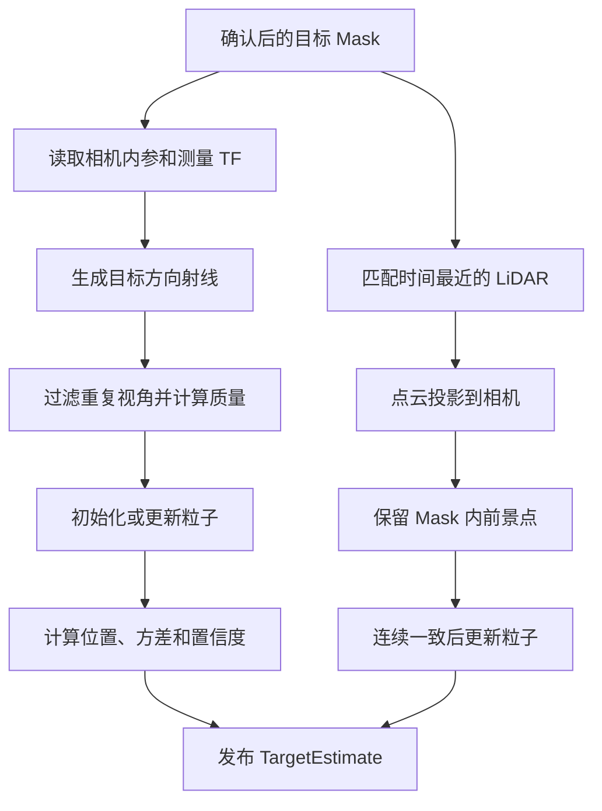

# 目标定位与视觉雷达融合

> 更新时间: 2026-07-23

## 1. 这个模块做什么

相机看到目标时, 单张图像通常只能告诉系统目标方向, 不能可靠给出距离

目标定位模块把不同位置看到的目标 Mask 合并, 估计目标三维位置, 再用合适的 LiDAR 回波修正近距离结果

```text
相机 -> 目标方向
机器人移动后的另一台或另一时刻相机 -> 新方向
多条方向射线 -> 缩小目标范围
LiDAR -> 提供近距离深度证据
```

## 2. 与其他模块的区别

| 阶段 | 回答的问题 | 负责模块 |
|---|---|---|
| 目标检测 | 图像里有没有目标 | WildOS |
| 目标定位 | 目标在哪里 | `object_target_fusion` 和粒子滤波 |
| 导航接近 | 机器人现在往哪里走 | Goal Mux 和 Planner |
| 最终完成 | 是否已经近距离确认目标 | WildOS 和 Goal Mux |

看到目标不等于已经知道准确位置, 到达估计坐标附近也不等于任务完成

## 3. 输入和输出

### 输入

| 数据 | 内容 |
|---|---|
| `ObjectMaskWithTf` | 确认后的目标 Mask、相机内参、测量时刻 TF 和相机分数 |
| 对齐点云 | 与 Mask 时间接近的 LiDAR 点云 |
| TF | 把点云和相机观测转换到统一世界坐标 |
| 完成通知 | Goal Mux 发布的最终完成状态 |

### 输出

| 数据 | 内容 |
|---|---|
| `TargetEstimate` | 目标位置、误差范围、置信度、状态、视角数和 LiDAR 支持点 |
| 目标 Marker | 目标位置和不确定范围 |
| 射线 Marker | 相机到目标估计的观察射线 |
| 粒子点云 | 当前目标可能位置分布 |

topic 名称以 `topic_profiles.yaml` 为准

## 4. 整体流程



## 5. 哪些 Mask 可以进入融合

Unity 当前视觉检测门槛:

- Mask 像素分数至少 0.100
- 首次峰值至少 0.120
- 后续确认峰值至少 0.110
- 连通区域至少 300 像素
- 3 帧窗口内至少 2 帧有效

只有确认窗口通过后才发布 `ObjectMaskWithTf`

消息必须携带观测时刻的相机 TF, 不能使用回调执行时的最新位姿代替

首次门槛仍保持 0.120, 防止较弱响应自行创建候选

只有首帧已经通过后, 后续帧才使用 0.110, 这样可减少目标清晰可见时反复卡在确认边缘的问题

## 6. 粒子滤波如何估计距离

第一张 Mask 到来时, 系统沿 Mask 内像素射线在最小和最大深度之间生成固定数量候选点, 这些点称为粒子

后续视角到来时:

1. 把粒子投影到相机图像
2. 落在目标 Mask 内的粒子提高权重
3. 远离目标方向的粒子降低权重
4. 权重过度集中时重新采样
5. 注入少量新粒子, 避免过早收敛到错误位置

最终位置是粒子的加权平均, 协方差表示目标范围有多分散

Unity 使用 1500 个粒子, 最大深度为 30 m

## 7. 重复、弱视角和独立视角

| 类型 | 判断 | 处理 |
|---|---|---|
| 完全重复 | 横向基线小于 0.03 m 且夹角小于 0.5 度 | 丢弃 |
| 弱视角 | 不重复, 但横向基线不足 0.12 m | 低权重更新, 不增加独立视角数 |
| 独立视角 | 相对已有独立视角的横向基线至少 0.12 m | 更新并增加视角数 |

0.3 m 横向基线和 3 度夹角只是满质量参考, 不是必须同时满足的硬门槛

这解决了远目标的问题: 目标越远, 有效横向移动产生的射线夹角越小, 不能因为夹角不足 3 度就丢掉整帧

沿目标方向直行没有横向视差, 不会增加独立视角数

原地旋转没有真实横向位移时只能提供弱证据, 不能代替换观察位置

## 8. 融合状态

| 状态 | 含义 | 可否作为稳定目标 |
|---|---|---|
| `EMPTY` | 没有目标观测 | 否 |
| `PENDING` | 只有一个独立视角 | 否 |
| `TRACKING` | 至少两个视角, 位置仍较粗 | 只能作为粗目标 |
| `STABLE_VISION` | 多视角位置和置信度稳定 | 是 |
| `LIDAR_LOCKED` | 连续 LiDAR 证据已经锁定距离 | 是 |
| `REACHED` | Goal Mux 已确认任务完成 | 终态 |

视觉稳定需要:

- 至少 2 个独立视角
- 水平标准差不超过 4 m
- 置信度不低于 0.6

置信度同时考虑独立视角质量、粒子分布和 LiDAR 证据

## 9. LiDAR 如何精修

融合节点缓存最近点云, 每个 Mask 选择时间戳最接近的一帧

Mask 和点云时间差必须不大于 0.25 s, 超过后本帧只做视觉融合

处理步骤:

1. 把点云转换到世界坐标
2. 投影到各相机
3. 把 Mask 向外扩张 3 像素, 吸收少量投影误差
4. 合并三相机结果, 同一个 LiDAR 点只计算一次
5. 至少保留 18 个 Mask 内点
6. 估计并去掉地面点
7. 在 XY 平面寻找空间连续的前景簇
8. 优先选择离相机较近的可见簇
9. 使用簇中位数作为 LiDAR 测量

3 像素容差只负责减少稀疏点云漏投影, 不能直接形成深度证据

单帧必须先通过去地面和空间聚类, 已有视觉轨迹时还必须连续两帧位置一致, 才会更新目标并进入 `LIDAR_LOCKED`

## 10. 粗目标如何接管导航

粒子滤波只计算位置, Goal Mux 决定能否控制机器人

粗目标需要:

- 至少 2 个独立视角
- 置信度至少 0.45
- 状态为 `TRACKING`、`STABLE_VISION` 或 `LIDAR_LOCKED`
- frame 正确
- 高度差不超过 1.5 m
- 距离不超过 30 m
- 水平标准差不超过 8 m

粗目标通过后, 机器人先到目标外约 2.75 m 的观察位置

单视角 `PENDING` 不会把粒子均值当作导航坐标

融合节点把当前 Mask 质心射线作为 world frame bearing 写入 `TargetEstimate`

Goal Mux 只读取该 bearing, 在当前位置面向该方向短暂停留 1.5 s, 不读取单视角粒子距离

如果仍然只有单视角证据, 机器人恢复原探索分支

两视角粗目标 3 s 内没有继续更新时也会失效, Planner 随后恢复抢占前保存的方向、活动分支和岔路记录

为减少 goal 抖动:

- 粗目标移动不足 0.75 m 时通常不更新
- 稳定目标移动不足 0.3 m 时通常不更新
- 来源或稳定性提升时允许立即更新

## 11. 谁决定 REACHED

粒子滤波器不会因为机器人靠近目标就自行完成任务

完成流程:

1. WildOS 连续检测到近距离目标
2. Goal Mux 检查视觉证据是否新鲜
3. Goal Mux 检查目标是否稳定
4. Goal Mux 检查机器人与目标距离
5. 通过后发布 completed
6. 融合状态进入 `REACHED`

这样可以避免机器人走到漂移的粗坐标附近就错误完成

## 12. 诊断信息

周期日志记录:

- Mask 和 LiDAR 输入频率
- Mask 收到、完成和错误数量
- 独立视角、有效权重、弱更新和重复丢弃
- LiDAR 匹配和精修成功率
- LiDAR 精修失败原因
- Mask 消息年龄和点云时间差
- 图像同步等待、三相机时间差、同步时图像年龄和 TF 等待
- 原始点、相机内点、Mask 内点、去地面点和最终簇点数
- 当前融合状态和各阶段耗时

单帧异常会被捕获, 不会直接结束融合进程

## 13. 当前效果和问题

优化前 Unity 基线:

- 第一帧 Mask 到 `TRACKING`: 12.46 s
- 第一帧 Mask 到 `STABLE_VISION`: 52.38 s
- Mask 平均消息年龄约 1.2 s, P95 约 1.4 s
- LiDAR 精修成功 1/8, 最终支持点为 0

视角软权重代码测试已经确认:

- 20 m 目标、0.15 m 横向基线、约 0.43 度夹角可以增加独立视角
- 0.06 m 弱基线会更新粒子, 但不会增加独立视角数
- 重复观测和沿射线直行不会增加证据

测试结果:

- 粒子滤波功能测试 9 项通过
- 目标链路功能测试 54 项通过, 1 项环境相关测试跳过
- 本轮目标融合与 LiDAR 精修定向测试 15 项通过
- 粗目标接管、bearing 和视觉标记测试合计 39 项通过
- Planner 探索暂停与恢复测试随 25 项探索测试通过
- `triangulation3d` 和 `visual_navigation` 构建通过

2026-07-22 代码检查发现:

- Unity 配置原来允许同步器缓存 120 组数据, 时间差可达 5 s
- TF 队列原来可缓存 8 组数据, 容易继续处理已经过时的同步结果
- LiDAR 与 Mask 原来允许 3 s 时间差, 无法保证精修使用同一时刻数据
- 同一个 LiDAR 点落入多个相机 Mask 时会重复计数
- 原来只记录精修成功或失败, 无法看出点在哪一步消失

已经调整:

- 同步器只保留 2 组数据, 最大时间差为 0.2 s
- TF 队列只保留最新 1 组数据, 每 0.05 s 检查一次
- 旧数据在处理前移出队列, 处理期间的新帧会被保留
- Mask 发布和融合订阅队列深度为 1, 不在节点间继续积压旧 Mask
- 分别记录同步等待、TF 等待、模型耗时和 Mask 发布年龄
- LiDAR 时间门槛收紧到 0.25 s, 增加唯一点计数、3 像素容差和分段点数统计

仍需 Unity 验证:

- Mask 平均约 1.2 s、P95 约 1.4 s 的年龄是否明显下降
- LiDAR 精修成功率是否高于原来的 1/8
- 3 像素容差和 18 点门槛是否会错误吸入背景
- 三相机外参和投影范围是否正确
- 稳定目标到 `REACHED` 的最终观察是否完整

## 14. 与论文的关系

论文的核心方法是:

1. 从目标 Mask 生成视觉射线
2. 使用 DLIO 位姿把不同视角转换到世界坐标
3. 根据粒子到多条射线的距离计算权重
4. 使用粒子加权位置作为粗目标
5. 目标进入 LiDAR 范围后使用 Mask 内点深度精修

当前实现保留这条主线, 并增加:

- 递归粒子更新和重采样
- 重复视角过滤和软质量权重
- 稳定轨迹关联保护
- LiDAR 地面和背景过滤
- 连续 LiDAR 一致性门槛
- 明确的融合状态机

论文没有把目标粒子强制绑定到 2.5D 高程图地面, 当前实现也没有这样做

目标可能位于墙面或高于地面, 强制贴地会产生系统性错误

## 15. 关键参数

| 参数 | 当前值 | 含义 |
|---|---:|---|
| `particle_count` | 1500 | 粒子数量 |
| `max_depth` | Unity 30 m | 第一视角最大深度 |
| `independent_view_translation` | 0.12 m | 独立视角最小横向基线 |
| `duplicate_view_translation` | 0.03 m | 重复观测平移范围 |
| `duplicate_view_angle_deg` | 0.5 度 | 重复观测角度范围 |
| `full_quality_translation` | 0.3 m | 满平移质量参考 |
| `full_quality_angle_deg` | 3 度 | 满夹角质量参考 |
| `stable_min_views` | 2 | 稳定目标最少视角 |
| `stable_max_horizontal_std` | 4 m | 稳定目标最大水平标准差 |
| `stable_min_confidence` | 0.6 | 稳定目标最低置信度 |
| `lidar_min_points` | 18 | LiDAR 精修最少 Mask 内点数 |
| `lidar_mask_dilation_pixels` | 3 | Mask 投影边缘容差 |
| `max_lidar_age_sec` | 0.25 s | Mask 和点云最大时间差 |
| `lidar_lock_frames` | 2 | LiDAR 锁定连续帧数 |

## 16. 代码入口

- `visual_navigation/visual_navigation/object_target_fusion.py`
- `triangulation3d/triangulation3d/target_particle_filter.py`
- `visual_navigation/visual_navigation/object_detection_confirmation.py`
- `visual_navigation/visual_navigation/object_reached_evidence.py`
- `visual_navigation/visual_navigation/object_search_goal_mux.py`
- `object_search_msgs/msg/ObjectMaskWithTf.msg`
- `object_search_msgs/msg/TargetEstimate.msg`
