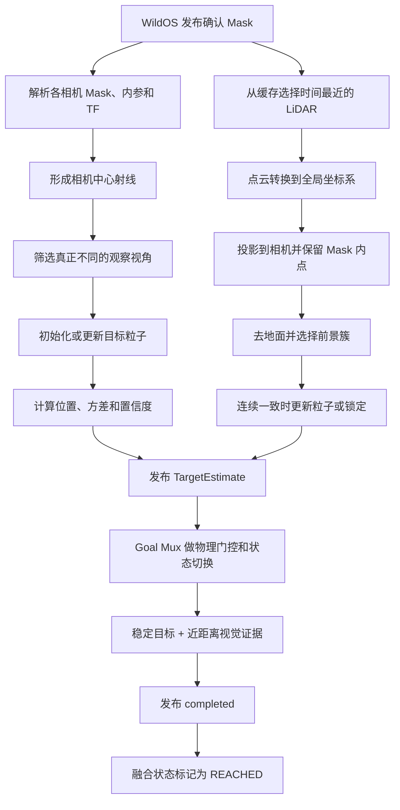
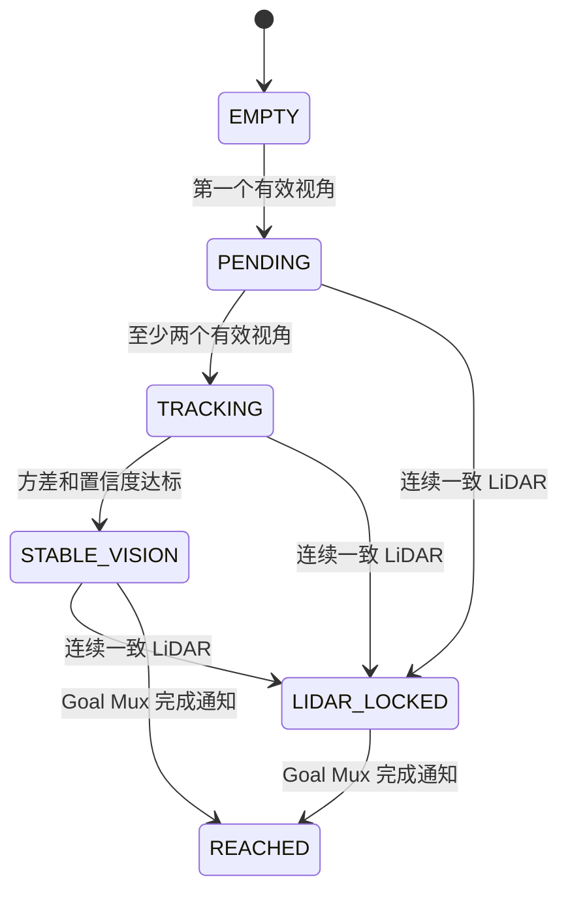

# 目标定位与视觉雷达融合

> 状态: 当前实现说明, 已完成视角软权重优化
>
> 更新时间: 2026-07-22

## 1. 这个模块解决什么问题

WildOS 从图像中识别出目标后, 只能知道目标出现在图像的哪个方向, 单张普通相机图像通常不能直接给出可靠距离

目标定位模块把不同位置看到的目标 Mask 组合起来, 估计目标在全局坐标系中的三维位置, 有合适 LiDAR 回波时再用点云修正距离

可以简单理解为:

- 相机告诉系统“目标在这条视线方向上”
- 机器人移动后再次观察, 两条视线共同缩小目标可能位置
- LiDAR 如果正好打到目标, 再给出更直接的距离证据

## 2. 目标检测、目标定位和目标完成的区别

| 阶段 | 回答的问题 | 负责模块 |
|---|---|---|
| 目标检测 | 图像里有没有目标 | WildOS |
| 目标定位 | 目标在全局坐标系的哪里 | `object_target_fusion` 和 `TargetParticleFilter` |
| 导航接近 | 现在应该走向哪里 | `ObjectSearchGoalMux` 和 Planner |
| 最终完成 | 是否已经在近距离再次看见目标 | WildOS 到达证据和 Goal Mux |

看到目标不等于已经知道准确位置, 到达估计坐标附近也不等于任务已经完成

## 3. 输入和输出

### 3.1 输入

| 输入 | 内容 |
|---|---|
| `ObjectMaskWithTf` | 确认后的多相机目标 Mask、相机内参、相机 TF、每路相机分数 |
| 对齐或去畸变点云 | 与 Mask 时间接近的 LiDAR 点云 |
| TF | 将点云和相机观测统一到全局坐标系 |
| `/spot1/object_search_completed` | Goal Mux 最终完成通知 |

### 3.2 输出

| 输出 | 内容 |
|---|---|
| `TargetEstimate` | 目标位置、协方差、置信度、来源、状态、有效视角数和 LiDAR 支持点数 |
| 目标 Marker | 目标位置和不确定度 |
| 观测射线 Marker | 相机到目标估计的射线 |
| 粒子点云 | 当前目标可能位置分布 |

Unity 当前典型 topic:

- Mask: `/spot1/object_mask`
- 点云: `/spot1/dlio/odom_node/pointcloud/deskewed`
- 估计: `/spot1/object_target_estimate`
- 完成: `/spot1/object_search_completed`

实际 topic 和 frame 以 `graph_construction/configs/topic_profiles.yaml` 为准

## 4. 整体流程



## 5. Mask 如何进入定位模块

WildOS 不会把每一帧相似区域都交给定位模块

Unity 当前目标检测需要:

- Mask 像素分数达到 0.100
- 首次峰值达到 0.120
- 确认阶段峰值达到 0.115
- 连通区域至少 300 像素并满足最小面积占比
- 3 帧窗口内至少 2 帧有效, 且当前帧必须有效

只有视觉窗口通过后才发布 `ObjectMaskWithTf`

消息中携带的是观测时刻对应的相机 TF, 定位模块不应使用“处理回调发生时”的最新相机位置代替测量时刻位置

## 6. 为什么使用粒子

第一张 Mask 只能确定一个空间锥体, 目标可能在这条方向上的近处或远处

当前实现沿 Mask 中像素对应的射线, 在最小和最大深度之间随机生成固定数量的目标候选点, 这些点称为粒子

```text
第一视角:
相机 A -------- 目标可能位于整条射线范围

第二视角:
相机 B -------- 新射线

两组射线共同支持的区域获得更高权重
```

Unity 使用 1500 个粒子, 射线最大深度为 30 m, 其他 profile 当前通常为 100 m

新视角到来时:

1. 将所有粒子投影回各个相机
2. 落在目标 Mask 内且接近 Mask 中心射线的粒子提高权重
3. 与多视角不一致的粒子降低权重
4. 有效粒子过少时重新采样并加入少量扰动
5. 保留一部分新随机粒子, 避免过早收敛到错误位置

最终位置是粒子的加权平均, 协方差表示粒子分布有多分散

## 7. 什么才算新的观察视角

重复画面、弱视角和独立视角现在分开处理:

| 类型 | 当前判断 | 处理方式 |
|---|---|---|
| 完全重复 | 横向基线小于 0.03 m 且夹角小于 0.5 度 | 丢弃, 不重复累计证据 |
| 弱视角 | 不重复, 但相对任一独立视角的横向基线不足 0.12 m | 低权重更新粒子, 不增加独立视角数 |
| 独立视角 | 相对所有已保留独立视角的横向基线至少 0.12 m | 更新粒子并增加独立视角数 |

0.3 m 横向基线和 3 度夹角不再是双重硬门槛, 它们现在只是视角质量达到满权重的参考尺度

视角质量由横向基线和射线夹角共同连续计算:

- 横向基线接近 0.3 m 时, 平移部分接近满分
- 射线夹角接近 3 度时, 夹角部分接近满分
- 远目标只有较小夹角时, 只要横向位移有效也不会丢掉整帧
- 质量较低的视角对粒子影响较小, 不能单独把状态推成稳定

这里真正提供深度信息的是相机相对目标方向的横向变化, 沿目标射线直行仍不会增加独立视角数

原地旋转可能改变射线方向, 但没有真实横向基线时只能作为弱观测, 因此粗目标观察在必要时仍应横向移动约 0.75 m

稳定轨迹形成后, 新射线如果离当前目标估计太远会被拒绝, 防止远处误检污染已经形成的目标

## 8. 视觉融合状态



| 状态 | 含义 | 是否可作为稳定目标 |
|---|---|---|
| `EMPTY` | 还没有任何目标观测 | 否 |
| `PENDING` | 有一个有效视角, 深度仍很不确定 | 否 |
| `TRACKING` | 至少两个视角, 已形成粗位置 | 否, 但可通过 Goal Mux 粗目标门控 |
| `STABLE_VISION` | 多视角位置和置信度达标 | 是 |
| `LIDAR_LOCKED` | 连续一致 LiDAR 已提供稳定距离 | 是 |
| `REACHED` | Goal Mux 已确认任务完成 | 终态 |

当前视觉稳定条件:

- 有效视角数至少 2
- 水平标准差不超过 4 m
- 置信度不低于 0.6

置信度综合考虑:

- 有效视角是否足够
- 粒子水平分布是否收敛
- 是否有连续一致的 LiDAR 证据

## 9. LiDAR 如何精修目标

### 9.1 时间匹配

融合节点缓存最近 40 帧点云, 每个 Mask 到来时选择时间戳最接近的点云

时间差超过 `max_lidar_age_sec` 时, 本帧只做视觉融合

### 9.2 投影到目标 Mask

点云先转换到全局坐标系, 然后分别转换到每个相机坐标系并投影到图像

只有投影位置落在目标 Mask 内的点才可能属于目标

### 9.3 去掉地面和背景

Mask 内可能同时包含地面或后方物体, 当前处理顺序:

1. 使用点高度的低分位估计局部地面
2. 优先保留高于地面至少 0.12 m 的点
3. 在 XY 平面按 0.75 m 邻域寻找前景簇
4. 存在多个簇时优先选择离相机较近的可见簇
5. 使用选中簇的中位数作为 LiDAR 测量位置

### 9.4 为什么单帧 LiDAR 不直接覆盖视觉

Mask 投影可能落到背景墙、地面或稀疏噪声点

已有视觉轨迹时, LiDAR 测量必须连续两帧空间一致, 相邻测量距离不超过 1.5 m, 才能真正更新粒子并进入 `LIDAR_LOCKED`

这能避免单帧背景点把目标位置突然拉走

## 10. 粗目标如何接管导航

`TargetParticleFilter` 负责计算估计, `ObjectSearchGoalMux` 决定估计是否可以控制机器人

粗目标需要:

- 至少 2 个有效视角
- 置信度不低于 0.5
- 状态为 `TRACKING`、`STABLE_VISION` 或 `LIDAR_LOCKED`
- 坐标系正确
- 与机器人高度差不超过 1.5 m
- 距离不超过 30 m
- 水平标准差不超过 8 m

粗目标通过后, 机器人先到目标外约 2.75 m 的安全观察位置, 面向目标继续积累证据

稳定目标只需要继续通过坐标系和高度门控, 然后进入稳定目标接近

为了减少导航目标抖动:

- 粗目标移动不足 0.75 m 时通常不更新 goal
- 稳定目标移动不足 0.3 m 时通常不更新 goal
- 来源提升、稳定性提升或置信度明显提升时允许立即更新

## 11. REACHED 由谁决定

粒子滤波器不会因为机器人靠近估计位置就自行进入 `REACHED`

完成流程是:

1. WildOS 在近距离检测到足够大的目标 Mask
2. 连续帧到达证据通过
3. Goal Mux 检查证据没有过期
4. Goal Mux 检查当前目标已经稳定
5. Goal Mux 检查机器人距离稳定目标不超过 2.0 m
6. Goal Mux 锁定完成并发布 `/spot1/object_search_completed=true`
7. 融合节点收到完成通知后把状态设为 `REACHED`

这避免机器人仅仅走到一个漂移的粗坐标附近就错误宣布成功

## 12. 失败保护和诊断

单帧 Mask 处理异常会被捕获, 不会让融合进程直接退出

LiDAR 精修失败按原因累计:

- 没有时间匹配点云
- 空点云
- 点云 TF 不可用
- Mask 内没有投影点
- Mask 内点数不足
- 地面过滤后点数不足
- 前景簇不足

周期日志同时记录:

- Mask 和 LiDAR 输入频率
- Mask 收到、完成、空数据和错误数量
- LiDAR 匹配和精修成功率
- Mask 消息年龄和点云匹配时间差
- 当前融合状态
- 各处理阶段耗时

## 13. 当前运行结论

### 13.1 优化前 Unity 运行

2026-07-22 最近一次完整 Unity 运行:

有效部分:

- Mask 处理没有错误或进程崩溃
- 第一帧 Mask 后正常进入 `PENDING`
- 12.46 s 后进入 `TRACKING`
- 52.38 s 后进入 `STABLE_VISION`
- 稳定估计能够被 Goal Mux 接受并触发目标路径

存在的问题:

- 8 帧 Mask 只有 1 次 LiDAR 精修成功
- 最终 LiDAR 支持点为 0, 稳定目标主要依赖视觉
- 主要精修失败原因是 Mask 内点数不足
- Mask 平均消息年龄约 1.2 s, P95 约 1.4 s
- 第一帧 Mask 到稳定定位 52.38 s, 明显偏慢
- 初始粗估计到稳定位置移动接近 6 m, 前期深度不确定性较大
- 到达目标附近后没有新的近距离有效 Mask, 最终未进入 `REACHED`

当前计算本身不慢, 主要瓶颈是有效视角来得慢、Mask 已经偏旧、LiDAR 投影支持不足和到达后没有继续面向目标确认

### 13.2 本轮代码验证

2026-07-22 已完成粒子视角筛选优化:

- 20 m 远目标、0.15 m 横向基线、约 0.43 度夹角可以增加独立视角
- 0.06 m 弱横向基线可以低权重更新粒子, 但独立视角数保持不变
- 完全重复观测和沿目标射线直行仍不会增加证据
- 独立视角数量与连续质量权重同时参与置信度, 避免低质量视角过快推高稳定状态
- 周期日志增加独立视角、有效权重、弱更新和重复丢弃统计

验证结果:

- `triangulation3d` 粒子滤波功能测试 9 项通过
- `visual_navigation` 目标链路功能测试 51 项通过
- `triangulation3d` 与 `visual_navigation` ROS 包联合构建通过

这些结果证明硬门槛问题已在代码层消除, 但不能直接证明 Unity 中 52.38 s 的稳定定位时间已经达到目标

仍需完整 Unity 运行对比首次 Mask 到 `TRACKING`、`STABLE_VISION` 的耗时, 同时继续排查约 1.2 s Mask 消息年龄和 LiDAR 精修率

## 14. 关键参数

| 参数 | 当前值 | 含义 |
|---|---:|---|
| `particle_count` | 1500 | 粒子数量 |
| `max_depth` | Unity 30 m | 第一视角最大搜索深度 |
| `independent_view_translation` | 0.12 m | 增加独立视角数的最小横向基线 |
| `duplicate_view_translation` | 0.03 m | 完全重复观测的平移范围 |
| `duplicate_view_angle_deg` | 0.5 度 | 完全重复观测的角度范围 |
| `full_quality_translation` | 0.3 m | 视角平移质量达到满分的参考值, 不是硬门槛 |
| `full_quality_angle_deg` | 3 度 | 视角夹角质量达到满分的参考值, 不是硬门槛 |
| `stable_min_views` | 2 | 稳定视觉最少视角 |
| `stable_max_horizontal_std` | 4 m | 稳定视觉最大水平标准差 |
| `stable_min_confidence` | 0.6 | 稳定视觉最低置信度 |
| `lidar_min_points` | 30 | LiDAR 精修最少 Mask 内点数 |
| `lidar_lock_frames` | 2 | LiDAR 锁定连续一致帧数 |
| `lidar_consistency_radius` | 1.5 m | 连续 LiDAR 测量一致范围 |

## 15. 代码入口

- `visual_navigation/visual_navigation/object_target_fusion.py`
- `triangulation3d/triangulation3d/target_particle_filter.py`
- `visual_navigation/visual_navigation/object_detection_confirmation.py`
- `visual_navigation/visual_navigation/object_reached_evidence.py`
- `visual_navigation/visual_navigation/object_search_goal_mux.py`
- `object_search_msgs/msg/ObjectMaskWithTf.msg`
- `object_search_msgs/msg/TargetEstimate.msg`

## 16. 与 WildOS 原论文的对应关系

论文目标定位方法见 [WildOS 4-D Coarse Goal Query Localization](https://arxiv.org/html/2602.19308#S4.SS4)

### 16.1 论文实际流程

论文描述的粗目标定位流程是:

1. 收集目标 Mask 非空的多个有效相机视角
2. 从每个 Mask 内随机选择像素
3. 为每个像素在 1 至 100 m 范围随机采样深度
4. 使用相机内参把像素和深度反投影为相机坐标系三维点
5. 使用该视角的相机位姿把三维点转换到世界坐标系
6. 从相机中心经过 Mask 质心建立主射线
7. 根据每个粒子到所有主射线的距离计算权重
8. 使用粒子加权位置作为粗目标坐标
9. 目标进入 LiDAR 有效范围后, 使用 Mask 内 LiDAR 点的中位深度进行精确定位

论文部署时机器人位姿由 DLIO 提供, 因此不同时间的相机观测能够统一到同一个起始世界坐标系

### 16.2 高程图不参与论文粒子高度约束

论文没有把粒子高度刚性绑定为 `z = h(x, y)`, 也没有使用 2.5D 高程图把三维粒子搜索降为地面二维流形

论文中的 elevation map 用于:

- 构建局部 traversability map
- 构建和更新稀疏导航图
- 表达几何传感器的 depth horizon
- 保证 Planner 选择的路线在已知地形上安全

目标粒子经常位于局部几何感知范围之外, 此时本来就没有可查询的可靠高程值, 而且论文目标可能是墙面标志、房屋或其他高于地面的物体, 强制贴地会产生系统性高度错误

因此, “视觉射线 + DLIO 位姿 + 粒子加权”属于论文目标定位主链路, “2.5D 高程图刚性约束粒子高度”不属于论文方法

### 16.3 当前实现与论文的差异

| 内容 | 论文 | 当前实现 |
|---|---|---|
| 粒子生成 | 每个有效视角采样 Mask 像素和随机深度 | 沿确认 Mask 像素和随机深度初始化, 后续持续注入新粒子 |
| 世界坐标变换 | 使用每个视角的相机位姿 | 使用 `ObjectMaskWithTf` 中测量时刻的相机 TF |
| 视觉权重 | 粒子到各主射线的距离 | 同时使用主射线距离和粒子投影是否落入 Mask |
| 时间融合 | 论文给出一次多视角粒子加权算法 | 当前实现递归保存粒子、更新权重、按 ESS 重采样 |
| 视角筛选 | 使用多个有效视角 | 过滤完全重复帧, 横向基线和夹角转换为连续质量权重 |
| LiDAR 近距离定位 | Mask 内 LiDAR 点中位深度 | Mask 投影点、地面过滤、前景聚类和连续两帧一致门控 |
| 状态管理 | 输出粗目标供 Planner 使用 | 增加 `PENDING`、`TRACKING`、`STABLE_VISION`、`LIDAR_LOCKED` 和 `REACHED` |
| 高程约束 | 未用于目标粒子 | 当前同样未用于目标粒子 |

当前实现保留了论文的核心思想, 但加入了递归滤波、误检关联门控、LiDAR 抗背景点保护和任务完成状态

### 16.4 如果未来增加地形先验

地形信息可以作为可选先验帮助排除明显错误粒子, 但不应简单把所有目标强制贴到地面

较安全的扩展方式是:

- 只在粒子 XY 位于有效 elevation cell 时使用地形信息
- 拒绝明显低于地面的粒子
- 根据目标类型允许 `z` 位于地面以上一定范围
- elevation unknown 或目标超出局部地图时保持原视觉粒子逻辑
- 将地形先验作为软权重, 不作为不可恢复的刚性投影

这属于可能的后续增强, 不是复现原论文所必需的缺失项
