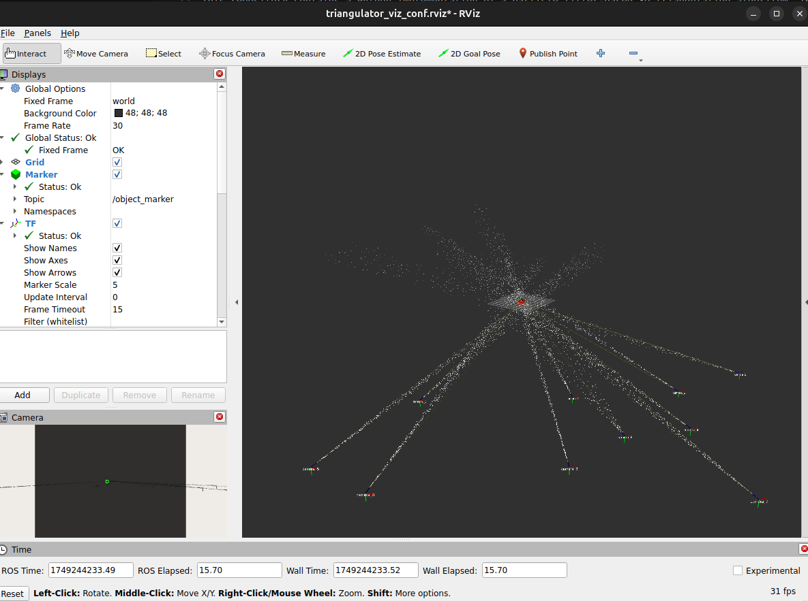
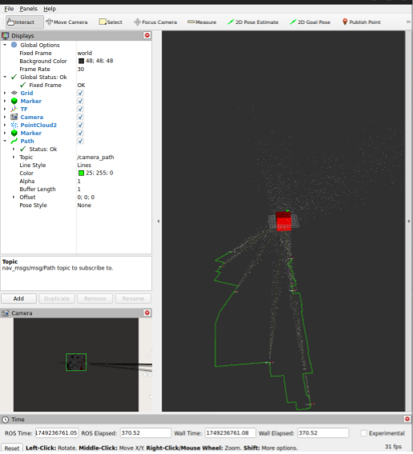

# Triangulation3D — Multi-View Target Fusion

This package contains the pure particle filter used to remember one target from multiple camera views.

## Overview

The current target fusion process is:

1. Sample a fixed number of 3D particles from a confirmed object Mask
2. Reweight the same particles with later camera views
3. Reject repeated views and observations that disagree with a stable target
4. Publish a coarse visual goal after two distinct views
5. Use consistent LiDAR measurements only as an optional refinement

The paper method does not require LiDAR for long-range localization. LiDAR points that project into the target Mask can provide a faster near-range lock, while pure multi-view vision remains the primary path.

## Key Files

| File | Description |
|---|---|
| `target_particle_filter.py` | Current fixed-size recursive target filter |
| `triangulator.py` | Legacy batch triangulation used by demos |
| `particle_generator.py` | Legacy particle sampling used by demos |

## Usage

### Multi-Camera Triangulation

To visualize multi-camera triangulation, where each camera position is randomly generated, run in separate terminals:

```bash
ros2 run triangulation3d triangulation_visualizer
```

The `triangulation_visualizer` node will publish random camera positions and the object in space, along with the triangulated position and the particles projected from each camera which can be visualized in RViz:



### Single Camera Triangulation with Teleoperation

To teleoperate the camera and triangulate the detected object, run in separate terminals:

```bash
ros2 run triangulation3d teleop_triangulation
ros2 run triangulation3d teleop_twist_keyboard
```

In the terminal running `teleop_twist_keyboard`, use the following keys to control the camera:

| Key | Action |
|---|---|
| `w` / `s` | Move forward / backward |
| `a` / `d` | Move left / right |
| `q` / `e` | Move up / down |
| `p` / `l` | Pitch up / down |
| `o` / `k` | Roll right / left |
| `i` / `j` | Yaw right / left |

Press `Ctrl+C` to stop the teleoperation.



## Integration with WildOS

During WildOS deployment, triangulation is handled by `visual_navigation/explorfm_triangulation/obj_mask_triangulation.py`, which receives object masks from the WildOS navigation node and uses the triangulation logic from this package to estimate goal positions.
